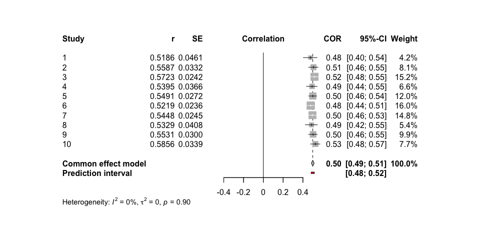
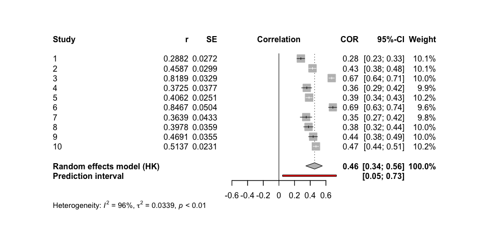

<!-- README.md is generated from README.Rmd. Please edit that file -->

# metafun

<!-- badges: start -->
<!-- badges: end -->

‘metafun’ offers valuable functions for teaching and understanding
statistical concepts related to meta-analyses using a simulation-based
approach. Please note that this package is currently under development,
and full functionality is not yet available.

## Installation

You can install the development version of metafun from
[GitHub](https://github.com/) with:

``` r
# install.packages("devtools")
devtools::install_github("simschaefer/metafun")
```

Load package in R:

``` r
require(metafun)
#> Loading required package: metafun
```

# Standardized Mean Differences

## Fixed Effect Model

### Simulate data

Simulates data of multiple studies using predefined effect sizes and
between study heterogenity ($\tau$).

``` r
sim <- sim_meta(min_obs = 20,
         max_obs = 2000,
         n_studies = 1500,
         smd_true = 0.3,
         r_true = 0,
         es = 'SMD',
         random = FALSE)

head(sim)
#> # A tibble: 6 × 10
#>   study hedges_g     se  mean_x mean_y  sd_x  sd_y   n_x   n_y      vi
#>   <int>    <dbl>  <dbl>   <dbl>  <dbl> <dbl> <dbl> <int> <int>   <dbl>
#> 1     1    0.273 0.0479  0.0124  0.281 0.955 1.01    878   878 0.00230
#> 2     2    0.256 0.0705  0.0203  0.282 1.02  1.02    406   406 0.00497
#> 3     3    0.330 0.0359 -0.0376  0.287 0.994 0.972  1572  1572 0.00129
#> 4     4    0.280 0.0392  0.0208  0.312 1.05  1.03   1314  1314 0.00154
#> 5     5    0.262 0.0521  0.0442  0.303 1.02  0.953   744   744 0.00271
#> 6     6    0.320 0.0325  0.0154  0.332 0.986 0.994  1913  1913 0.00106
```

### Effect size and standard error

``` r
require(tidyverse)

ggplot(sim, aes(x = hedges_g, y = log(se), color = n_x))+
  geom_point(alpha = 0.5)+
  theme_minimal()+
  labs(x = "Effect Size (ES)",
       y = "log(SE)")+
  scale_color_viridis_c()
```


### Run Meta-Analysis on simulated data

``` r
require(meta)

# choose only studies 1-10 for better readability
analysis_data <- sim %>% 
  filter(study <= 10)

meta_fixed <- metagen(TE = hedges_g,
                 seTE = se,
                 studlab = study,
                 data = analysis_data,
                 sm = "SMD",
                 fixed = TRUE,
                 random = FALSE,
                 title = "Meta-Analysis Fixed effect")

summary(meta_fixed)
#> Review:     Meta-Analysis Fixed effect
#> 
#>       SMD           95%-CI %W(common)
#> 1  0.2727 [0.1788; 0.3667]        7.9
#> 2  0.2561 [0.1180; 0.3942]        3.7
#> 3  0.3303 [0.2599; 0.4007]       14.2
#> 4  0.2796 [0.2028; 0.3564]       11.9
#> 5  0.2621 [0.1600; 0.3641]        6.7
#> 6  0.3197 [0.2560; 0.3835]       17.2
#> 7  0.3515 [0.1483; 0.5546]        1.7
#> 8  0.2694 [0.2054; 0.3334]       17.1
#> 9  0.3266 [0.2301; 0.4230]        7.5
#> 10 0.3134 [0.2369; 0.3898]       12.0
#> 
#> Number of studies: k = 10
#> 
#>                        SMD           95%-CI     z  p-value
#> Common effect model 0.2982 [0.2717; 0.3247] 22.07 < 0.0001
#> 
#> Quantifying heterogeneity:
#>  tau^2 = 0 [0.0000; 0.0009]; tau = 0 [0.0000; 0.0302]
#>  I^2 = 0.0% [0.0%; 62.4%]; H = 1.00 [1.00; 1.63]
#> 
#> Test of heterogeneity:
#>     Q d.f. p-value
#>  4.11    9  0.9042
#> 
#> Details on meta-analytical method:
#> - Inverse variance method
#> - Restricted maximum-likelihood estimator for tau^2
#> - Q-Profile method for confidence interval of tau^2 and tau
```

### Forest plot

``` r
metafor::forest(meta_fixed,
             prediction = TRUE, 
             print.tau2 = TRUE,
             leftlabs = c("Study", "g", "SE"))
```


## Random-Effects model Standardized Mean Difference

### Simulate data

``` r
sim <- sim_meta(min_obs = 20,
         max_obs = 2000,
         n_studies = 1500,
         smd_true = 0.7,
         es = 'SMD',
         random = TRUE,
         tau = 0.05)

head(sim)
#> # A tibble: 6 × 10
#>   study hedges_g     se    mean_x mean_y  sd_x  sd_y   n_x   n_y      vi
#>   <int>    <dbl>  <dbl>     <dbl>  <dbl> <dbl> <dbl> <int> <int>   <dbl>
#> 1     1    0.696 0.0592 -0.0298    0.665 0.984 1.01    606   606 0.00350
#> 2     2    0.790 0.0384 -0.0958    0.712 1.01  1.03   1464  1464 0.00147
#> 3     3    0.683 0.0555 -0.000944  0.699 1.04  1.01    686   686 0.00309
#> 4     4    0.751 0.0397 -0.0102    0.740 1.00  0.992  1356  1356 0.00158
#> 5     5    0.589 0.105   0.0541    0.650 0.983 1.04    189   189 0.0110 
#> 6     6    0.683 0.0534 -0.0477    0.642 1.01  1.01    742   742 0.00285
```

### Run Meta-Analysis on simulated data

``` r
require(meta)
require(metafor)

# choose only studies 1-10 for better readability
analysis_data <- sim %>% 
  filter(study <= 10)

meta_random <- metagen(TE = hedges_g,
                 seTE = se,
                 studlab = study,
                 data = analysis_data,
                 sm = "SMD",
                 fixed = FALSE,
                 random = TRUE,
                 method.tau = 'REML',
                 method.random.ci = "HK",
                 title = "Meta-Analysis Random Effects")

summary(meta_random)
#> Review:     Meta-Analysis Random Effects
#> 
#>       SMD           95%-CI %W(random)
#> 1  0.6961 [0.5802; 0.8121]        9.5
#> 2  0.7904 [0.7152; 0.8656]       14.0
#> 3  0.6832 [0.5743; 0.7920]       10.2
#> 4  0.7513 [0.6735; 0.8292]       13.7
#> 5  0.5886 [0.3826; 0.7945]        4.4
#> 6  0.6834 [0.5787; 0.7881]       10.6
#> 7  0.5863 [0.5081; 0.6645]       13.7
#> 8  0.4314 [0.0663; 0.7964]        1.6
#> 9  0.6665 [0.5969; 0.7361]       14.8
#> 10 0.7364 [0.5946; 0.8782]        7.5
#> 
#> Number of studies: k = 10
#> 
#>                              SMD           95%-CI     t  p-value
#> Random effects model (HK) 0.6889 [0.6347; 0.7432] 28.72 < 0.0001
#> 
#> Quantifying heterogeneity:
#>  tau^2 = 0.0028 [0.0001; 0.0206]; tau = 0.0532 [0.0083; 0.1435]
#>  I^2 = 54.3% [6.8%; 77.6%]; H = 1.48 [1.04; 2.11]
#> 
#> Test of heterogeneity:
#>      Q d.f. p-value
#>  19.69    9  0.0199
#> 
#> Details on meta-analytical method:
#> - Inverse variance method
#> - Restricted maximum-likelihood estimator for tau^2
#> - Q-Profile method for confidence interval of tau^2 and tau
#> - Hartung-Knapp adjustment for random effects model (df = 9)


metafor::forest(meta_random,
             prediction = TRUE, 
             print.tau2 = TRUE,
             leftlabs = c("Study", "g", "SE"))
```


# Correlations

## Fixed Effect Model

### Simulate data

Simulates data of multiple studies using predefined effect sizes and
between study heterogenity ($\tau$).

``` r
sim <- sim_meta(min_obs = 20,
         max_obs = 2000,
         n_studies = 1500,
         smd_true = 0,
         r_true = 0.5,
         es = 'ZCOR',
         random = FALSE)

head(sim)
#> # A tibble: 6 × 5
#>   study     z     r     n     se
#>   <int> <dbl> <dbl> <int>  <dbl>
#> 1     1 0.537 0.490  1277 0.0280
#> 2     2 0.561 0.509   882 0.0337
#> 3     3 0.503 0.464  1077 0.0305
#> 4     4 0.558 0.506  1275 0.0280
#> 5     5 0.631 0.559   275 0.0606
#> 6     6 0.519 0.477   751 0.0366
```

### Run Meta-Analysis on simulated data

``` r
require(meta)

# choose only studies 1-10 for better readability
analysis_data <- sim %>% 
  filter(study <= 10)

meta_fixed <- metagen(TE = z,
                 seTE = se,
                 studlab = study,
                 data = analysis_data,
                 sm = "ZCOR",
                 fixed = TRUE,
                 random = FALSE,
                 title = "Meta-Analysis Fixed effect")

summary(meta_fixed)
#> Review:     Meta-Analysis Fixed effect
#> 
#>       COR           95%-CI %W(common)
#> 1  0.4905 [0.4476; 0.5310]       13.6
#> 2  0.5088 [0.4582; 0.5561]        9.4
#> 3  0.4645 [0.4163; 0.5101]       11.4
#> 4  0.5062 [0.4642; 0.5459]       13.5
#> 5  0.5587 [0.4716; 0.6350]        2.9
#> 6  0.4767 [0.4194; 0.5301]        8.0
#> 7  0.4838 [0.4486; 0.5175]       20.2
#> 8  0.5005 [0.4257; 0.5685]        4.5
#> 9  0.4922 [0.3889; 0.5832]        2.5
#> 10 0.4776 [0.4349; 0.5182]       14.0
#> 
#> Number of studies: k = 10
#> 
#>                        COR           95%-CI     z p-value
#> Common effect model 0.4898 [0.4743; 0.5050] 51.92       0
#> 
#> Quantifying heterogeneity:
#>  tau^2 = 0 [0.0000; 0.0018]; tau = 0 [0.0000; 0.0420]
#>  I^2 = 0.0% [0.0%; 62.4%]; H = 1.00 [1.00; 1.63]
#> 
#> Test of heterogeneity:
#>     Q d.f. p-value
#>  5.54    9  0.7847
#> 
#> Details on meta-analytical method:
#> - Inverse variance method
#> - Restricted maximum-likelihood estimator for tau^2
#> - Q-Profile method for confidence interval of tau^2 and tau
#> - Fisher's z transformation of correlations
```

### Forest plot

``` r
metafor::forest(meta_fixed,
             prediction = TRUE, 
             print.tau2 = TRUE,
             leftlabs = c("Study", "r", "SE"))
```



## Random Effects Model

### Simulate data

``` r
sim <- sim_meta(min_obs = 20,
         max_obs = 2000,
         n_studies = 1500,
         smd_true = 0,
         r_true = 0.5,
         es = 'ZCOR',
         random = TRUE,
         tau = 0.1)

head(sim)
#> # A tibble: 6 × 5
#>   study     z     r     n     se
#>   <int> <dbl> <dbl> <int>  <dbl>
#> 1     1 0.403 0.383   560 0.0424
#> 2     2 0.519 0.477   764 0.0362
#> 3     3 0.449 0.421  1941 0.0227
#> 4     4 0.510 0.470  1393 0.0268
#> 5     5 0.363 0.348  1481 0.0260
#> 6     6 0.666 0.582   593 0.0412
```

### Run Meta-Analysis on simulated data

``` r
require(meta)
require(metafor)

# choose only studies 1-10 for better readability
analysis_data <- sim %>% 
  filter(study <= 10)

meta_random <- metagen(TE = z,
                 seTE = se,
                 studlab = study,
                 data = analysis_data,
                 sm = "ZCOR",
                 fixed = FALSE,
                 random = TRUE,
                 method.tau = 'REML',
                 method.random.ci = "HK",
                 title = "Meta-Analysis Random Effects")

summary(meta_random)
#> Review:     Meta-Analysis Random Effects
#> 
#>       COR           95%-CI %W(random)
#> 1  0.3827 [0.3097; 0.4513]        9.5
#> 2  0.4766 [0.4199; 0.5297]        9.8
#> 3  0.4208 [0.3835; 0.4568]       10.4
#> 4  0.4703 [0.4283; 0.5102]       10.2
#> 5  0.3477 [0.3021; 0.3917]       10.3
#> 6  0.5825 [0.5266; 0.6333]        9.6
#> 7  0.4947 [0.4506; 0.5365]       10.2
#> 8  0.4453 [0.3834; 0.5033]        9.7
#> 9  0.2324 [0.1774; 0.2860]       10.1
#> 10 0.5234 [0.4816; 0.5628]       10.2
#> 
#> Number of studies: k = 10
#> 
#>                              COR           95%-CI     t  p-value
#> Random effects model (HK) 0.4414 [0.3696; 0.5080] 12.46 < 0.0001
#> 
#> Quantifying heterogeneity:
#>  tau^2 = 0.0134 [0.0058; 0.0473]; tau = 0.1157 [0.0758; 0.2175]
#>  I^2 = 93.2% [89.4%; 95.6%]; H = 3.82 [3.08; 4.75]
#> 
#> Test of heterogeneity:
#>       Q d.f.  p-value
#>  131.47    9 < 0.0001
#> 
#> Details on meta-analytical method:
#> - Inverse variance method
#> - Restricted maximum-likelihood estimator for tau^2
#> - Q-Profile method for confidence interval of tau^2 and tau
#> - Hartung-Knapp adjustment for random effects model (df = 9)
#> - Fisher's z transformation of correlations


metafor::forest(meta_random,
             prediction = TRUE, 
             print.tau2 = TRUE,
             leftlabs = c("Study", "r", "SE"))
```


