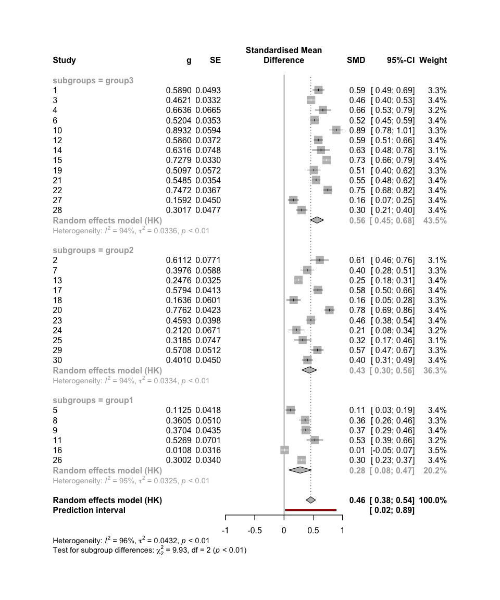
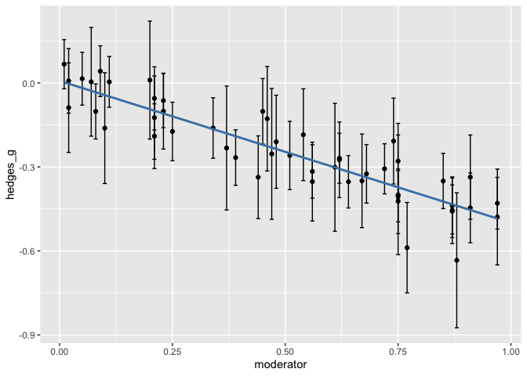
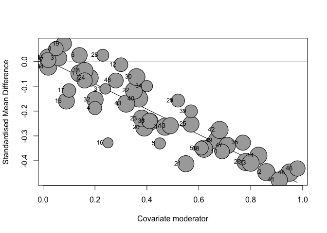

<!-- README.md is generated from README.Rmd. Please edit that file -->

# metafun

<!-- badges: start -->
<!-- badges: end -->

‘metafun’ offers valuable functions for teaching and understanding
statistical concepts related to meta-analyses using a simulation-based
approach. Please note that this package is currently under development,
and full functionality is not yet available.

## Installation

You can install the development version of metafun from
[GitHub](https://github.com/) with:

``` r
# install.packages("devtools")
devtools::install_github("simschaefer/metafun")
```

Load package in R:

``` r
require(metafun)
#> Loading required package: metafun
```

# Standardized Mean Differences

## Fixed Effect Model

### Simulate Data

Simulates data of multiple studies using predefined effect sizes and
between study heterogenity ($\tau$).

``` r
sim <- sim_meta(min_obs = 20,
         max_obs = 2000,
         n_studies = 1500,
         smd_true = 0.3,
         r_true = 0,
         random = FALSE,
         metaregression = FALSE)

head(sim)
#> # A tibble: 6 × 14
#>   study hedges_g        z        r   se_g   se_z    mean1  mean2   sd1   sd2
#>   <int>    <dbl>    <dbl>    <dbl>  <dbl>  <dbl>    <dbl>  <dbl> <dbl> <dbl>
#> 1     1    0.280 -0.0346  -0.0346  0.0492 0.0347 -0.0385  0.241  1.03  0.966
#> 2     2    0.295 -0.0385  -0.0385  0.0344 0.0242 -0.00495 0.286  0.984 0.989
#> 3     3    0.291  0.0413   0.0413  0.0380 0.0268 -0.00367 0.293  1.03  1.01 
#> 4     4    0.318 -0.0486  -0.0485  0.0480 0.0338 -0.0414  0.282  1.03  1.00 
#> 5     5    0.428 -0.00640 -0.00640 0.0597 0.0418 -0.0545  0.370  0.997 0.984
#> 6     6    0.165 -0.125   -0.124   0.171  0.123  -0.0956  0.0730 0.997 1.04 
#> # ℹ 4 more variables: n1 <int>, n2 <int>, n <int>, variance_g <dbl>
```

### Effect size and standard error

``` r
require(tidyverse)

ggplot(sim, aes(x = hedges_g, y = log(se_g), color = n1))+
  geom_point(alpha = 0.5)+
  theme_minimal()+
  labs(x = "Effect Size (ES)",
       y = "log(SE)")+
  scale_color_viridis_c()
```


### Run Meta-Analysis on simulated data

``` r
require(meta)

#select only studies 1-10 for better readability
sim <- sim %>% 
  filter(study <= 10)

meta_fixed <- metagen(TE = hedges_g,
                 seTE = se_g,
                 studlab = study,
                 data = sim,
                 sm = "SMD",
                 fixed = TRUE,
                 random = FALSE,
                 title = "Meta-Analysis Fixed effect")

summary(meta_fixed)
#> Review:     Meta-Analysis Fixed effect
#> 
#>       SMD            95%-CI %W(common)
#> 1  0.2799 [ 0.1835; 0.3763]        8.6
#> 2  0.2950 [ 0.2276; 0.3623]       17.6
#> 3  0.2910 [ 0.2165; 0.3655]       14.3
#> 4  0.3184 [ 0.2243; 0.4126]        9.0
#> 5  0.4283 [ 0.3112; 0.5453]        5.8
#> 6  0.1646 [-0.1697; 0.4989]        0.7
#> 7  0.3784 [ 0.0945; 0.6624]        1.0
#> 8  0.3201 [ 0.2473; 0.3930]       15.0
#> 9  0.2206 [ 0.1221; 0.3190]        8.2
#> 10 0.3104 [ 0.2470; 0.3738]       19.8
#> 
#> Number of studies: k = 10
#> 
#>                        SMD           95%-CI     z  p-value
#> Common effect model 0.3036 [0.2754; 0.3318] 21.08 < 0.0001
#> 
#> Quantifying heterogeneity:
#>  tau^2 = 0 [0.0000; 0.0087]; tau = 0 [0.0000; 0.0935]
#>  I^2 = 0.0% [0.0%; 62.4%]; H = 1.00 [1.00; 1.63]
#> 
#> Test of heterogeneity:
#>     Q d.f. p-value
#>  8.77    9  0.4592
#> 
#> Details on meta-analytical method:
#> - Inverse variance method
#> - Restricted maximum-likelihood estimator for tau^2
#> - Q-Profile method for confidence interval of tau^2 and tau
```

### Forest plot

``` r
metafor::forest(meta_fixed,
             prediction = TRUE, 
             print.tau2 = TRUE,
             leftlabs = c("Study", "g", "SE"))
```


## Random-Effects model Standardized Mean Difference

### Simulate Data

``` r
sim <- sim_meta(min_obs = 200,
         max_obs = 2000,
         n_studies = 10,
         smd_true = 0.7,
         random = TRUE,
         random_effects = c('SMD'),
         tau = 0.05)

head(sim)
#> # A tibble: 6 × 14
#>   study hedges_g        z        r   se_g   se_z   mean1 mean2   sd1   sd2    n1
#>   <int>    <dbl>    <dbl>    <dbl>  <dbl>  <dbl>   <dbl> <dbl> <dbl> <dbl> <int>
#> 1     1    0.777  0.0172   0.0172  0.0655 0.0448  0.0488 0.789 0.958 0.946   502
#> 2     2    0.682 -0.00244 -0.00244 0.0481 0.0331 -0.0158 0.677 1.05  0.975   916
#> 3     3    0.735 -0.0515  -0.0515  0.0776 0.0533 -0.0605 0.663 1.01  0.952   355
#> 4     4    0.701  0.0154   0.0154  0.0443 0.0305 -0.0147 0.698 1.01  1.03   1080
#> 5     5    0.768 -0.00689 -0.00689 0.0479 0.0328 -0.0134 0.737 0.984 0.970   934
#> 6     6    0.760  0.00923  0.00923 0.0347 0.0237 -0.0409 0.727 0.983 1.03   1776
#> # ℹ 3 more variables: n2 <int>, n <int>, variance_g <dbl>
```

### Run Meta-Analysis on simulated data

``` r
require(meta)
require(metafor)

meta_random <- metagen(TE = hedges_g,
                 seTE = se_g,
                 studlab = study,
                 data = sim,
                 sm = "SMD",
                 fixed = FALSE,
                 random = TRUE,
                 method.tau = 'REML',
                 method.random.ci = "HK",
                 title = "Meta-Analysis Random Effects")

summary(meta_random)
#> Review:     Meta-Analysis Random Effects
#> 
#>       SMD           95%-CI %W(random)
#> 1  0.7768 [0.6485; 0.9051]        8.5
#> 2  0.6825 [0.5883; 0.7767]       12.3
#> 3  0.7351 [0.5831; 0.8871]        6.6
#> 4  0.7006 [0.6137; 0.7875]       13.4
#> 5  0.7679 [0.6740; 0.8619]       12.4
#> 6  0.7602 [0.6921; 0.8283]       16.5
#> 7  0.5894 [0.4394; 0.7395]        6.8
#> 8  0.5873 [0.3969; 0.7777]        4.7
#> 9  0.7888 [0.7079; 0.8698]       14.3
#> 10 0.4874 [0.2938; 0.6810]        4.5
#> 
#> Number of studies: k = 10
#> 
#>                              SMD           95%-CI     t  p-value
#> Random effects model (HK) 0.7154 [0.6563; 0.7746] 27.37 < 0.0001
#> 
#> Quantifying heterogeneity:
#>  tau^2 = 0.0020 [0.0000; 0.0275]; tau = 0.0450 [0.0000; 0.1657]
#>  I^2 = 46.6% [0.0%; 74.3%]; H = 1.37 [1.00; 1.97]
#> 
#> Test of heterogeneity:
#>      Q d.f. p-value
#>  16.87    9  0.0509
#> 
#> Details on meta-analytical method:
#> - Inverse variance method
#> - Restricted maximum-likelihood estimator for tau^2
#> - Q-Profile method for confidence interval of tau^2 and tau
#> - Hartung-Knapp adjustment for random effects model (df = 9)


metafor::forest(meta_random,
             prediction = TRUE, 
             print.tau2 = TRUE,
             leftlabs = c("Study", "g", "SE"))
```


# Correlations

## Fixed Effect Model

### Simulate data

Simulates data of multiple studies using predefined effect sizes and
between study heterogenity ($\tau$).

``` r
sim <- sim_meta(min_obs = 200,
         max_obs = 2000,
         n_studies = 10,
         smd_true = 0,
         r_true = 0.5,
         random = FALSE)

head(sim)
#> # A tibble: 6 × 14
#>   study hedges_g     z     r   se_g   se_z    mean1   mean2   sd1   sd2    n1
#>   <int>    <dbl> <dbl> <dbl>  <dbl>  <dbl>    <dbl>   <dbl> <dbl> <dbl> <int>
#> 1     1  0.0471  0.548 0.499 0.0387 0.0274 -0.0739  -0.0272 0.978 1.00   1336
#> 2     2 -0.00172 0.514 0.473 0.0387 0.0274  0.0234   0.0217 1.02  0.963  1333
#> 3     3 -0.0378  0.547 0.498 0.0455 0.0322  0.0177  -0.0197 0.996 0.976   965
#> 4     4  0.0199  0.557 0.506 0.0475 0.0337 -0.00550  0.0147 1.01  1.02    886
#> 5     5 -0.0148  0.544 0.496 0.0357 0.0253 -0.0166  -0.0314 0.976 1.02   1570
#> 6     6  0.00474 0.562 0.510 0.0324 0.0229 -0.0182  -0.0135 0.980 0.968  1903
#> # ℹ 3 more variables: n2 <int>, n <int>, variance_g <dbl>
```

### Run Meta-Analysis on simulated data

``` r
require(meta)

meta_fixed <- metagen(TE = z,
                 seTE = se_z,
                 studlab = study,
                 data = sim,
                 sm = "ZCOR",
                 fixed = TRUE,
                 random = FALSE,
                 title = "Meta-Analysis Fixed effect")

summary(meta_fixed)
#> Review:     Meta-Analysis Fixed effect
#> 
#>       COR           95%-CI %W(common)
#> 1  0.4991 [0.4577; 0.5383]       10.7
#> 2  0.4728 [0.4301; 0.5135]       10.7
#> 3  0.4982 [0.4492; 0.5442]        7.7
#> 4  0.5057 [0.4549; 0.5531]        7.1
#> 5  0.4960 [0.4578; 0.5324]       12.6
#> 6  0.5096 [0.4755; 0.5421]       15.3
#> 7  0.5201 [0.4791; 0.5589]       10.3
#> 8  0.4832 [0.4417; 0.5226]       11.1
#> 9  0.4861 [0.4383; 0.5311]        8.4
#> 10 0.5155 [0.4607; 0.5665]        6.0
#> 
#> Number of studies: k = 10
#> 
#>                        COR           95%-CI     z p-value
#> Common effect model 0.4983 [0.4850; 0.5114] 60.96       0
#> 
#> Quantifying heterogeneity:
#>  tau^2 = 0 [0.0000; 0.0005]; tau = 0 [0.0000; 0.0223]
#>  I^2 = 0.0% [0.0%; 62.4%]; H = 1.00 [1.00; 1.63]
#> 
#> Test of heterogeneity:
#>     Q d.f. p-value
#>  4.35    9  0.8872
#> 
#> Details on meta-analytical method:
#> - Inverse variance method
#> - Restricted maximum-likelihood estimator for tau^2
#> - Q-Profile method for confidence interval of tau^2 and tau
#> - Fisher's z transformation of correlations
```

### Forest plot

``` r
metafor::forest(meta_fixed,
             prediction = TRUE, 
             print.tau2 = TRUE,
             leftlabs = c("Study", "r", "SE"))
```


## Random Effects Model

### Simulate data

``` r
sim <- sim_meta(min_obs = 200,
         max_obs = 2000,
         n_studies = 10,
         smd_true = 0,
         r_true = 0.5,
         random = TRUE,
         random_effects = c('ZCOR'),
         tau = 0.1)

head(sim)
#> # A tibble: 6 × 14
#>   study hedges_g     z     r   se_g   se_z    mean1   mean2   sd1   sd2    n1
#>   <int>    <dbl> <dbl> <dbl>  <dbl>  <dbl>    <dbl>   <dbl> <dbl> <dbl> <int>
#> 1     1 -0.00430 0.533 0.488 0.0748 0.0531 -0.0658  -0.0701 1.02  0.956   357
#> 2     2  0.0156  0.555 0.504 0.0338 0.0239 -0.0421  -0.0262 1.03  1.02   1750
#> 3     3 -0.0206  0.612 0.545 0.0493 0.0349 -0.00874 -0.0294 1.00  1.01    822
#> 4     4 -0.0210  0.425 0.401 0.0343 0.0243 -0.0202  -0.0412 1.00  0.998  1701
#> 5     5 -0.0253  0.632 0.559 0.0351 0.0249  0.00966 -0.0148 0.972 0.963  1619
#> 6     6  0.0279  0.466 0.435 0.0379 0.0268 -0.00797  0.0195 0.990 0.983  1396
#> # ℹ 3 more variables: n2 <int>, n <int>, variance_g <dbl>
```

### Run Meta-Analysis on simulated data

``` r

meta_random <- metagen(TE = z,
                 seTE = se_z,
                 studlab = study,
                 data = sim,
                 sm = "ZCOR",
                 fixed = FALSE,
                 random = TRUE,
                 method.tau = 'REML',
                 method.random.ci = "HK",
                 title = "Meta-Analysis Random Effects")

summary(meta_random)
#> Review:     Meta-Analysis Random Effects
#> 
#>       COR           95%-CI %W(random)
#> 1  0.4879 [0.4046; 0.5632]        8.3
#> 2  0.5043 [0.4685; 0.5384]       10.5
#> 3  0.5454 [0.4955; 0.5917]        9.7
#> 4  0.4013 [0.3606; 0.4404]       10.5
#> 5  0.5594 [0.5250; 0.5920]       10.4
#> 6  0.4347 [0.3911; 0.4763]       10.3
#> 7  0.4523 [0.4125; 0.4904]       10.4
#> 8  0.4531 [0.3911; 0.5110]        9.5
#> 9  0.5631 [0.5194; 0.6038]       10.0
#> 10 0.3420 [0.2981; 0.3845]       10.4
#> 
#> Number of studies: k = 10
#> 
#>                              COR           95%-CI     t  p-value
#> Random effects model (HK) 0.4763 [0.4229; 0.5264] 17.51 < 0.0001
#> 
#> Quantifying heterogeneity:
#>  tau^2 = 0.0080 [0.0033; 0.0277]; tau = 0.0894 [0.0573; 0.1664]
#>  I^2 = 91.6% [86.6%; 94.7%]; H = 3.44 [2.73; 4.34]
#> 
#> Test of heterogeneity:
#>       Q d.f.  p-value
#>  106.54    9 < 0.0001
#> 
#> Details on meta-analytical method:
#> - Inverse variance method
#> - Restricted maximum-likelihood estimator for tau^2
#> - Q-Profile method for confidence interval of tau^2 and tau
#> - Hartung-Knapp adjustment for random effects model (df = 9)
#> - Fisher's z transformation of correlations


metafor::forest(meta_random,
             prediction = TRUE, 
             print.tau2 = TRUE,
             leftlabs = c("Study", "r", "SE"))
```


# Subgroup-Analysis Standardized Mean Difference

### Simulate Data

``` r
sim <- sim_meta(min_obs = 200,
         max_obs = 2000,
         n_studies = 30,
         smd_true = 0.2,
         r_true = 0,
         random = TRUE,
         tau = 0.1,
         random_effects = c('SMD'),
         metaregression = TRUE,
         smd_mod_effects = c(0.1,0.2,0.3),
         r_mod_effects = c(0,0,0),
         mod_labels = c('group1', 'group2', 'group3'))

head(sim %>% 
       select(study, hedges_g, subgroups, everything()))
#> # A tibble: 6 × 19
#>   study hedges_g subgroups         z        r   se_g   se_z   mean1  mean2   sd1
#>   <int>    <dbl> <chr>         <dbl>    <dbl>  <dbl>  <dbl>   <dbl>  <dbl> <dbl>
#> 1     1    0.589 group3     0.0264    2.64e-2 0.0493 0.0342 -0.0657 0.539   1.03
#> 2     2    0.611 group2    -0.0321   -3.21e-2 0.0771 0.0535 -0.151  0.473   1.00
#> 3     3    0.462 group3    -0.000345 -3.45e-4 0.0332 0.0232 -0.0349 0.429   1.01
#> 4     4    0.664 group3     0.0120    1.20e-2 0.0665 0.0459 -0.114  0.562   1.02
#> 5     5    0.112 group1     0.0536    5.35e-2 0.0418 0.0296 -0.0161 0.0985  1.02
#> 6     6    0.520 group3    -0.0129   -1.29e-2 0.0353 0.0246  0.0108 0.545   1.01
#> # ℹ 9 more variables: sd2 <dbl>, n1 <int>, n2 <int>, n <int>,
#> #   smd_mod_effects <dbl>, r_mod_effects <dbl>, r_true <dbl>, smd_true <dbl>,
#> #   variance_g <dbl>
```

### Run Meta-Analysis on simulated data

``` r
meta_random <- metagen(TE = hedges_g,
                 seTE = se_g,
                 studlab = study,
                 data = sim,
                 sm = "SMD",
                 fixed = FALSE,
                 random = TRUE,
                 method.tau = 'REML',
                 method.random.ci = "HK",
                 subgroup = subgroups,
                 title = "Meta-Analysis Random Effects")

summary(meta_random)
#> Review:     Meta-Analysis Random Effects
#> 
#>       SMD            95%-CI %W(random) subgroups
#> 1  0.5890 [ 0.4924; 0.6857]        3.3    group3
#> 2  0.6112 [ 0.4600; 0.7623]        3.1    group2
#> 3  0.4621 [ 0.3970; 0.5273]        3.4    group3
#> 4  0.6636 [ 0.5333; 0.7940]        3.2    group3
#> 5  0.1125 [ 0.0305; 0.1944]        3.4    group1
#> 6  0.5204 [ 0.4512; 0.5896]        3.4    group3
#> 7  0.3976 [ 0.2823; 0.5128]        3.3    group2
#> 8  0.3605 [ 0.2605; 0.4604]        3.3    group1
#> 9  0.3704 [ 0.2852; 0.4557]        3.4    group1
#> 10 0.8932 [ 0.7768; 1.0097]        3.3    group3
#> 11 0.5269 [ 0.3895; 0.6643]        3.2    group1
#> 12 0.5860 [ 0.5131; 0.6590]        3.4    group3
#> 13 0.2476 [ 0.1840; 0.3113]        3.4    group2
#> 14 0.6316 [ 0.4850; 0.7783]        3.1    group3
#> 15 0.7279 [ 0.6631; 0.7926]        3.4    group3
#> 16 0.0108 [-0.0512; 0.0728]        3.5    group1
#> 17 0.5794 [ 0.4985; 0.6604]        3.4    group2
#> 18 0.1636 [ 0.0458; 0.2813]        3.3    group2
#> 19 0.5097 [ 0.3977; 0.6217]        3.3    group3
#> 20 0.7762 [ 0.6932; 0.8592]        3.4    group2
#> 21 0.5485 [ 0.4790; 0.6179]        3.4    group3
#> 22 0.7472 [ 0.6753; 0.8192]        3.4    group3
#> 23 0.4593 [ 0.3813; 0.5374]        3.4    group2
#> 24 0.2120 [ 0.0806; 0.3435]        3.2    group2
#> 25 0.3185 [ 0.1721; 0.4649]        3.1    group2
#> 26 0.3002 [ 0.2336; 0.3668]        3.4    group1
#> 27 0.1592 [ 0.0711; 0.2473]        3.4    group3
#> 28 0.3017 [ 0.2082; 0.3952]        3.4    group3
#> 29 0.5708 [ 0.4704; 0.6711]        3.3    group2
#> 30 0.4010 [ 0.3128; 0.4893]        3.4    group2
#> 
#> Number of studies: k = 30
#> 
#>                              SMD           95%-CI     t  p-value
#> Random effects model (HK) 0.4578 [0.3781; 0.5375] 11.75 < 0.0001
#> 
#> Quantifying heterogeneity:
#>  tau^2 = 0.0432 [0.0264; 0.0797]; tau = 0.2080 [0.1626; 0.2822]
#>  I^2 = 96.1% [95.2%; 96.8%]; H = 5.04 [4.55; 5.59]
#> 
#> Test of heterogeneity:
#>       Q d.f.  p-value
#>  736.76   29 < 0.0001
#> 
#> Results for subgroups (random effects model (HK)):
#>                      k    SMD           95%-CI  tau^2    tau      Q   I^2
#> subgroups = group3  13 0.5632 [0.4486; 0.6779] 0.0336 0.1834 207.02 94.2%
#> subgroups = group2  11 0.4321 [0.3042; 0.5600] 0.0334 0.1827 157.83 93.7%
#> subgroups = group1   6 0.2753 [0.0791; 0.4716] 0.0325 0.1803  94.61 94.7%
#> 
#> Test for subgroup differences (random effects model (HK)):
#>                   Q d.f. p-value
#> Between groups 9.93    2  0.0070
#> 
#> Details on meta-analytical method:
#> - Inverse variance method
#> - Restricted maximum-likelihood estimator for tau^2
#> - Q-Profile method for confidence interval of tau^2 and tau
#> - Hartung-Knapp adjustment for random effects model (df = 29)


metafor::forest(meta_random,
             prediction = TRUE, 
             print.tau2 = TRUE,
             leftlabs = c("Study", "g", "SE"))
```



# Metaregression

## Simulate Data

``` r

# define values of moderator variable:
x <- 1:100/100

# define slope:
b <- -0.5

df <- sim_meta(min_obs = 100,
               max_obs = 1000,
               n_studies = 50,
               smd_true = 0,
               r_true = 0,
               random = TRUE,
               tau = 0.1,
               random_effects = c('SMD'),
               metaregression = TRUE,
               mod_name = 'moderator',
               smd_mod_effects = b*x,
               r_mod_effects = rep(0,100),
               mod_labels = x)

# show correlation between moderator and effect size
df %>% 
  mutate(g_upper = hedges_g + 1.96*se_g,
         g_lower = hedges_g - 1.96*se_g) %>% 
ggplot(aes(moderator,hedges_g))+
  geom_point()+
  geom_errorbar(aes(ymin = g_lower, ymax = g_upper))+
  geom_smooth(method = 'lm', se = FALSE, color = 'steelblue')
#> `geom_smooth()` using formula = 'y ~ x'
```



``` r

mg <- metagen(TE = hedges_g,
              seTE = se_g,
              studlab = study,
              data = df,
              sm = "SMD",
              fixed = FALSE,
              random = TRUE,
              method.tau = 'REML',
              title = "Meta-Analysis fixed-effect",
              tau.common = FALSE)

m.gen.reg <- metareg(mg, ~moderator)

summary(m.gen.reg)
#> 
#> Mixed-Effects Model (k = 50; tau^2 estimator: REML)
#> 
#>   logLik  deviance       AIC       BIC      AICc   
#>  18.1188  -36.2376  -30.2376  -24.6240  -29.6921   
#> 
#> tau^2 (estimated amount of residual heterogeneity):     0.0234 (SE = 0.0056)
#> tau (square root of estimated tau^2 value):             0.1530
#> I^2 (residual heterogeneity / unaccounted variability): 87.65%
#> H^2 (unaccounted variability / sampling variability):   8.10
#> R^2 (amount of heterogeneity accounted for):            13.44%
#> 
#> Test for Residual Heterogeneity:
#> QE(df = 48) = 383.2466, p-val < .0001
#> 
#> Test of Moderators (coefficient 2):
#> QM(df = 1) = 7.7130, p-val = 0.0055
#> 
#> Model Results:
#> 
#>            estimate      se     zval    pval    ci.lb    ci.ub     
#> intrcpt     -0.1110  0.0592  -1.8745  0.0609  -0.2270   0.0051   . 
#> moderator   -0.2623  0.0944  -2.7772  0.0055  -0.4474  -0.0772  ** 
#> 
#> ---
#> Signif. codes:  0 '***' 0.001 '**' 0.01 '*' 0.05 '.' 0.1 ' ' 1

bubble(m.gen.reg, studlab = TRUE)
```


