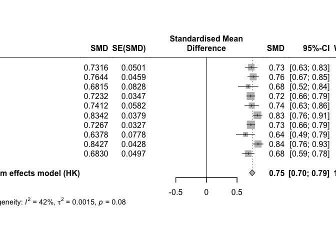

<!-- README.md is generated from README.Rmd. Please edit that file -->

# metafun

<!-- badges: start -->
<!-- badges: end -->

‘metafun’ offers valuable functions for teaching and understanding
statistical concepts related to meta-analyses using a simulation-based
approach. Please note that this package is currently under development,
and full functionality is not yet available.

## Installation

You can install the development version of metafun from
[GitHub](https://github.com/) with:

``` r
# install.packages("devtools")
devtools::install_github("simschaefer/metafun")
```

## Example

This is a basic example which shows you how to solve a common problem:

``` r
library(metafun)
## basic example code
```

## Simulate Fixed-Effects model

Simulates data of multiple studies using predefined effect sizes and
between study heterogenity ($\tau$).

``` r
sim <- sim_meta(min_obs = 20,
         max_obs = 2000,
         n_studies = 1500,
         smd_true = 0.3,
         r_true = 0,
         es = 'SMD',
         random = FALSE)

head(sim)
#> # A tibble: 6 × 10
#>   study hedges_g     se  mean_x mean_y  sd_x  sd_y   n_x   n_y      vi
#>   <int>    <dbl>  <dbl>   <dbl>  <dbl> <dbl> <dbl> <int> <int>   <dbl>
#> 1     1    0.286 0.0381  0.0386  0.326 1.00  1.01   1391  1391 0.00145
#> 2     2    0.272 0.0426 -0.0317  0.242 1.01  1.00   1110  1110 0.00182
#> 3     3    0.332 0.0435 -0.0222  0.308 1.00  0.981  1070  1070 0.00189
#> 4     4    0.334 0.0395 -0.0295  0.302 0.986 0.995  1302  1302 0.00156
#> 5     5    0.338 0.0448  0.0132  0.357 1.01  1.03   1009  1009 0.00201
#> 6     6    0.263 0.0447  0.0292  0.290 0.988 0.990  1009  1009 0.00200
```

# Effect size and standard error

``` r
require(tidyverse)
#> Loading required package: tidyverse
#> ── Attaching core tidyverse packages ──────────────────────── tidyverse 2.0.0 ──
#> ✔ dplyr     1.1.4     ✔ readr     2.1.4
#> ✔ forcats   1.0.0     ✔ stringr   1.5.0
#> ✔ ggplot2   3.4.4     ✔ tibble    3.2.1
#> ✔ lubridate 1.9.3     ✔ tidyr     1.3.0
#> ✔ purrr     1.0.2     
#> ── Conflicts ────────────────────────────────────────── tidyverse_conflicts() ──
#> ✖ dplyr::filter() masks stats::filter()
#> ✖ dplyr::lag()    masks stats::lag()
#> ℹ Use the conflicted package (<http://conflicted.r-lib.org/>) to force all conflicts to become errors

ggplot(sim, aes(x = hedges_g, y = log(se), color = n_x))+
  geom_point(alpha = 0.5)+
  theme_minimal()+
  labs(x = "Effect Size (ES)",
       y = "log(SE)")+
  scale_color_viridis_c()
```


# Run Meta-Analysis on simulated data

``` r
require(meta)
#> Loading required package: meta
#> Loading required package: metadat
#> Loading 'meta' package (version 7.0-0).
#> Type 'help(meta)' for a brief overview.
#> Readers of 'Meta-Analysis with R (Use R!)' should install
#> older version of 'meta' package: https://tinyurl.com/dt4y5drs

metaanalysis <- metagen(TE = hedges_g,
                 seTE = se,
                 studlab = study,
                 data = sim %>% filter(study <= 10),
                 sm = "SMD",
                 fixed = TRUE,
                 random = FALSE,
                 title = "Meta-Analysis fixed-effect")

summary(metaanalysis)
#> Review:     Meta-Analysis fixed-effect
#> 
#>       SMD           95%-CI %W(common)
#> 1  0.2856 [0.2109; 0.3603]       13.9
#> 2  0.2717 [0.1881; 0.3552]       11.1
#> 3  0.3322 [0.2469; 0.4175]       10.6
#> 4  0.3343 [0.2570; 0.4117]       13.0
#> 5  0.3376 [0.2498; 0.4255]       10.0
#> 6  0.2634 [0.1758; 0.3510]       10.1
#> 7  0.3300 [0.2607; 0.3992]       16.2
#> 8  0.3367 [0.2198; 0.4537]        5.7
#> 9  0.2582 [0.1417; 0.3747]        5.7
#> 10 0.3520 [0.2079; 0.4960]        3.7
#> 
#> Number of studies: k = 10
#> 
#>                        SMD           95%-CI     z  p-value
#> Common effect model 0.3093 [0.2815; 0.3371] 21.77 < 0.0001
#> 
#> Quantifying heterogeneity:
#>  tau^2 = 0 [0.0000; 0.0018]; tau = 0 [0.0000; 0.0424]
#>  I^2 = 0.0% [0.0%; 62.4%]; H = 1.00 [1.00; 1.63]
#> 
#> Test of heterogeneity:
#>     Q d.f. p-value
#>  4.93    9  0.8404
#> 
#> Details on meta-analytical method:
#> - Inverse variance method
#> - Restricted maximum-likelihood estimator for tau^2
#> - Q-Profile method for confidence interval of tau^2 and tau
```

# Forest plot

``` r
forest(metaanalysis)
```

 \#
Simulate Random-Effects model

``` r
sim <- sim_meta(min_obs = 20,
         max_obs = 2000,
         n_studies = 1500,
         smd_true = 0.7,
         es = 'SMD',
         random = TRUE,
         tau = 0.05)

head(sim)
#> # A tibble: 6 × 10
#>   study hedges_g     se  mean_x mean_y  sd_x  sd_y   n_x   n_y      vi
#>   <int>    <dbl>  <dbl>   <dbl>  <dbl> <dbl> <dbl> <int> <int>   <dbl>
#> 1     1    0.711 0.0455 -0.0109  0.691 0.999 0.975  1028  1028 0.00207
#> 2     2    0.689 0.0827  0.0370  0.738 1.04  0.998   310   310 0.00683
#> 3     3    0.590 0.0380  0.0977  0.692 1.02  0.992  1445  1445 0.00144
#> 4     4    0.624 0.0343  0.0152  0.644 1.02  0.998  1786  1786 0.00117
#> 5     5    0.832 0.0568 -0.0323  0.808 1.01  1.00    673   673 0.00323
#> 6     6    0.769 0.0372 -0.0618  0.708 0.999 1.00   1555  1555 0.00138
```

Run Random-Effects Meta-Analysis

``` r
require(meta)
require(metafor)
#> Loading required package: metafor
#> Loading required package: Matrix
#> 
#> Attaching package: 'Matrix'
#> The following objects are masked from 'package:tidyr':
#> 
#>     expand, pack, unpack
#> Loading required package: numDeriv
#> 
#> Loading the 'metafor' package (version 4.4-0). For an
#> introduction to the package please type: help(metafor)

metaanalysis <- metagen(TE = hedges_g,
                 seTE = se,
                 studlab = study,
                 data = sim %>% filter(study <= 10),
                 sm = "SMD",
                 fixed = FALSE,
                 random = TRUE,
                 method.tau = 'PM',
                 method.random.ci = "HK",
                 title = "Meta-Analysis fixed-effect")

summary(metaanalysis)
#> Review:     Meta-Analysis fixed-effect
#> 
#>       SMD           95%-CI %W(random)
#> 1  0.7112 [0.6220; 0.8003]       10.1
#> 2  0.6885 [0.5265; 0.8506]        6.1
#> 3  0.5904 [0.5159; 0.6649]       11.0
#> 4  0.6243 [0.5571; 0.6914]       11.5
#> 5  0.8316 [0.7202; 0.9430]        8.7
#> 6  0.7692 [0.6964; 0.8421]       11.1
#> 7  0.6372 [0.5654; 0.7089]       11.2
#> 8  0.6572 [0.5817; 0.7327]       10.9
#> 9  0.5666 [0.4833; 0.6498]       10.4
#> 10 0.7698 [0.6642; 0.8754]        9.0
#> 
#> Number of studies: k = 10
#> 
#>                              SMD           95%-CI     t  p-value
#> Random effects model (HK) 0.6794 [0.6184; 0.7404] 25.18 < 0.0001
#> 
#> Quantifying heterogeneity:
#>  tau^2 = 0.0051 [0.0013; 0.0223]; tau = 0.0717 [0.0366; 0.1493]
#>  I^2 = 72.3% [47.6%; 85.4%]; H = 1.90 [1.38; 2.62]
#> 
#> Test of heterogeneity:
#>      Q d.f. p-value
#>  32.52    9  0.0002
#> 
#> Details on meta-analytical method:
#> - Inverse variance method
#> - Paule-Mandel estimator for tau^2
#> - Q-Profile method for confidence interval of tau^2 and tau
#> - Hartung-Knapp adjustment for random effects model (df = 9)


metafor::forest(metaanalysis, header = TRUE)
```


