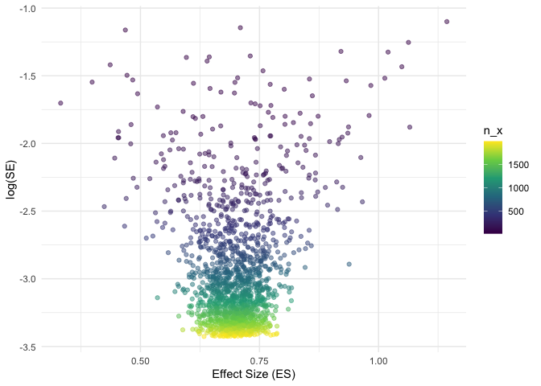
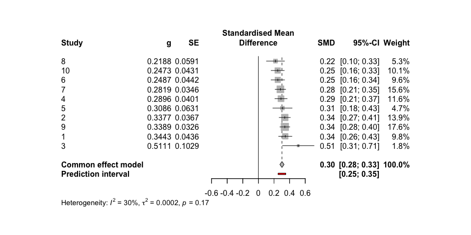

<!-- README.md is generated from README.Rmd. Please edit that file -->

# metafun

<!-- badges: start -->
<!-- badges: end -->

metafun provides useful functions to teach and understand statistical
concept related to Meta-Analyses.

## Installation

You can install the development version of metafun from
[GitHub](https://github.com/) with:

``` r
# install.packages("devtools")
devtools::install_github("simschaefer/metafun")
```

## Example

This is a basic example which shows you how to solve a common problem:

``` r
library(metafun)
## basic example code
```

## sim_meta

Simulates data of multiple studies using predefined effect sizes and
between study heterogenity ($\tau$).

``` r
sim <- sim_meta(min_obs = 20,
         max_obs = 2000,
         n_studies = 1500,
         es_true = 0.7,
         es = 'SMD',
         fixed = TRUE,
         random = FALSE,
         varnames = c('x', 'y'))

head(sim$data_aggr)
#> # A tibble: 6 × 10
#>   study hedges_g     se mean_x    mean_y  sd_x  sd_y   n_x   n_y      vi
#>   <int>    <dbl>  <dbl>  <dbl>     <dbl> <dbl> <dbl> <int> <int>   <dbl>
#> 1     1    0.734 0.0331  0.706 -0.0230   0.994 0.991  1953  1953 0.00109
#> 2     2    0.644 0.0380  0.679  0.0366   1.02  0.978  1455  1455 0.00145
#> 3     3    0.681 0.0516  0.676  0.0134   0.972 0.972   795   795 0.00266
#> 4     4    0.715 0.0581  0.685 -0.0423   1.01  1.02    631   631 0.00337
#> 5     5    0.706 0.0395  0.715  0.000428 1.02  1.01   1363  1363 0.00156
#> 6     6    0.765 0.0559  0.726 -0.0431   0.996 1.01    686   686 0.00313
```

# Effect size and standard error

``` r
require(tidyverse)
#> Loading required package: tidyverse
#> ── Attaching core tidyverse packages ──────────────────────── tidyverse 2.0.0 ──
#> ✔ dplyr     1.1.4     ✔ readr     2.1.4
#> ✔ forcats   1.0.0     ✔ stringr   1.5.0
#> ✔ ggplot2   3.4.4     ✔ tibble    3.2.1
#> ✔ lubridate 1.9.3     ✔ tidyr     1.3.0
#> ✔ purrr     1.0.2     
#> ── Conflicts ────────────────────────────────────────── tidyverse_conflicts() ──
#> ✖ dplyr::filter() masks stats::filter()
#> ✖ dplyr::lag()    masks stats::lag()
#> ℹ Use the conflicted package (<http://conflicted.r-lib.org/>) to force all conflicts to become errors

ggplot(sim$data_aggr, aes(x = hedges_g, y = log(se), color = n_x))+
  geom_point(alpha = 0.5)+
  theme_minimal()+
  labs(x = "Effect Size (ES)",
       y = "log(SE)")+
  scale_color_viridis_c()
```

 \#
Run Meta-Analysis

``` r
require(meta)
#> Loading required package: meta
#> Loading required package: metadat
#> Loading 'meta' package (version 7.0-0).
#> Type 'help(meta)' for a brief overview.
#> Readers of 'Meta-Analysis with R (Use R!)' should install
#> older version of 'meta' package: https://tinyurl.com/dt4y5drs

metaanalysis <- metagen(TE = hedges_g,
                 seTE = se,
                 studlab = study,
                 data = sim$data_aggr %>% filter(study <= 10),
                 sm = "SMD",
                 fixed = TRUE,
                 random = FALSE,
                 title = "Meta-Analysis fixed-effect")

summary(metaanalysis)
#> Review:     Meta-Analysis fixed-effect
#> 
#>       SMD           95%-CI %W(common)
#> 1  0.7338 [0.6690; 0.7986]       22.6
#> 2  0.6442 [0.5697; 0.7188]       17.1
#> 3  0.6813 [0.5801; 0.7824]        9.3
#> 4  0.7151 [0.6013; 0.8289]        7.3
#> 5  0.7058 [0.6284; 0.7832]       15.8
#> 6  0.7653 [0.6556; 0.8749]        7.9
#> 7  0.6556 [0.5077; 0.8036]        4.3
#> 8  0.5609 [0.3758; 0.7460]        2.8
#> 9  0.7154 [0.6120; 0.8189]        8.9
#> 10 0.7469 [0.5962; 0.8976]        4.2
#> 
#> Number of studies: k = 10
#> 
#>                        SMD           95%-CI     z p-value
#> Common effect model 0.7011 [0.6703; 0.7319] 44.65       0
#> 
#> Quantifying heterogeneity:
#>  tau^2 = 0 [0.0000; 0.0063]; tau = 0 [0.0000; 0.0797]
#>  I^2 = 0.0% [0.0%; 62.4%]; H = 1.00 [1.00; 1.63]
#> 
#> Test of heterogeneity:
#>     Q d.f. p-value
#>  7.75    9  0.5599
#> 
#> Details on meta-analytical method:
#> - Inverse variance method
#> - Restricted maximum-likelihood estimator for tau^2
#> - Q-Profile method for confidence interval of tau^2 and tau
```

# Forest plot

``` r
forest(metaanalysis)
```


