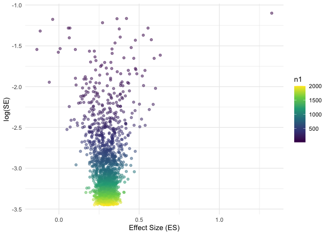
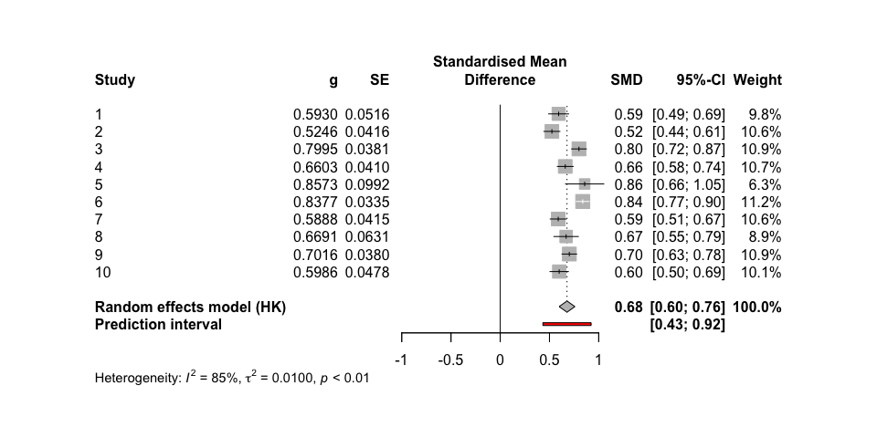

<!-- README.md is generated from README.Rmd. Please edit that file -->

# metafun

<!-- badges: start -->
<!-- badges: end -->

‘metafun’ offers valuable functions for teaching and understanding
statistical concepts related to meta-analyses using a simulation-based
approach. Please note that this package is currently under development,
and full functionality is not yet available.

## Installation

You can install the development version of metafun from
[GitHub](https://github.com/) with:

``` r
# install.packages("devtools")
devtools::install_github("simschaefer/metafun")
```

Load package in R:

``` r
require(metafun)
#> Loading required package: metafun
```

# Fixed-Effects model Standardized Mean Difference

## Simulate data

Simulates data of multiple studies using predefined effect sizes and
between study heterogenity ($\tau$).

``` r
sim <- sim_meta(min_obs = 20,
         max_obs = 2000,
         n_studies = 1500,
         smd_true = 0.3,
         r_true = 0,
         es = 'SMD',
         random = FALSE)

head(sim)
#> # A tibble: 6 × 10
#>   study hedges_g     se   mean_x mean_y  sd_x  sd_y   n_x   n_y      vi
#>   <int>    <dbl>  <dbl>    <dbl>  <dbl> <dbl> <dbl> <int> <int>   <dbl>
#> 1     1    0.382 0.0389 -0.0451   0.331 0.988 0.986  1348  1348 0.00151
#> 2     2    0.308 0.0863 -0.0794   0.227 1.03  0.960   272   272 0.00744
#> 3     3    0.397 0.0357 -0.00463  0.389 1.00  0.974  1599  1599 0.00128
#> 4     4    0.263 0.0323  0.0259   0.289 0.987 1.01   1939  1939 0.00104
#> 5     5    0.344 0.0614 -0.00594  0.331 0.977 0.982   538   538 0.00377
#> 6     6    0.308 0.0325 -0.0179   0.294 1.01  1.02   1920  1920 0.00105
```

## Effect size and standard error

``` r
require(tidyverse)

ggplot(sim, aes(x = hedges_g, y = log(se), color = n_x))+
  geom_point(alpha = 0.5)+
  theme_minimal()+
  labs(x = "Effect Size (ES)",
       y = "log(SE)")+
  scale_color_viridis_c()
```



## Run Meta-Analysis on simulated data

``` r
require(meta)

metaanalysis <- metagen(TE = hedges_g,
                 seTE = se,
                 studlab = study,
                 data = sim %>% filter(study <= 10),
                 sm = "SMD",
                 fixed = TRUE,
                 random = FALSE,
                 title = "Meta-Analysis fixed-effect")

summary(metaanalysis)
#> Review:     Meta-Analysis fixed-effect
#> 
#>       SMD            95%-CI %W(common)
#> 1  0.3815 [ 0.3053; 0.4577]       10.7
#> 2  0.3077 [ 0.1387; 0.4768]        2.2
#> 3  0.3975 [ 0.3275; 0.4675]       12.7
#> 4  0.2633 [ 0.2000; 0.3265]       15.5
#> 5  0.3443 [ 0.2239; 0.4647]        4.3
#> 6  0.3077 [ 0.2440; 0.3713]       15.3
#> 7  0.3610 [ 0.2931; 0.4289]       13.4
#> 8  0.3058 [ 0.2395; 0.3721]       14.1
#> 9  0.3435 [ 0.2638; 0.4231]        9.8
#> 10 0.1305 [-0.0425; 0.3036]        2.1
#> 
#> Number of studies: k = 10
#> 
#>                        SMD           95%-CI     z  p-value
#> Common effect model 0.3283 [0.3034; 0.3532] 25.85 < 0.0001
#> 
#> Quantifying heterogeneity:
#>  tau^2 = 0.0012 [0.0000; 0.0141]; tau = 0.0346 [0.0000; 0.1185]
#>  I^2 = 46.1% [0.0%; 74.1%]; H = 1.36 [1.00; 1.96]
#> 
#> Test of heterogeneity:
#>      Q d.f. p-value
#>  16.71    9  0.0535
#> 
#> Details on meta-analytical method:
#> - Inverse variance method
#> - Restricted maximum-likelihood estimator for tau^2
#> - Q-Profile method for confidence interval of tau^2 and tau
```

## Forest plot

``` r
metafor::forest(metaanalysis,
             sortvar = TE,
             prediction = TRUE, 
             print.tau2 = TRUE,
             leftlabs = c("Study", "g", "SE"))
```


# Random-Effects model Standardized Mean Difference

## Simulate data

``` r
sim <- sim_meta(min_obs = 20,
         max_obs = 2000,
         n_studies = 1500,
         smd_true = 0.7,
         es = 'SMD',
         random = TRUE,
         tau = 0.05)

head(sim)
#> # A tibble: 6 × 10
#>   study hedges_g     se  mean_x mean_y  sd_x  sd_y   n_x   n_y      vi
#>   <int>    <dbl>  <dbl>   <dbl>  <dbl> <dbl> <dbl> <int> <int>   <dbl>
#> 1     1    1.07  0.276  -0.291   0.716 0.963 0.900    30    30 0.0762 
#> 2     2    0.702 0.0717 -0.0610  0.647 0.954 1.06    413   413 0.00514
#> 3     3    0.611 0.103  -0.0405  0.578 0.996 1.02    199   199 0.0105 
#> 4     4    0.690 0.106   0.0294  0.699 0.947 0.990   188   188 0.0113 
#> 5     5    0.613 0.0394  0.0427  0.670 1.04  1.00   1347  1347 0.00155
#> 6     6    0.793 0.108  -0.180   0.628 1.05  0.982   186   186 0.0116
```

## Run Meta-Analysis on simulated data

``` r
require(meta)
require(metafor)

metaanalysis <- metagen(TE = hedges_g,
                 seTE = se,
                 studlab = study,
                 data = sim %>% filter(study <= 10),
                 sm = "SMD",
                 fixed = FALSE,
                 random = TRUE,
                 method.tau = 'PM',
                 method.random.ci = "HK",
                 title = "Meta-Analysis fixed-effect")

summary(metaanalysis)
#> Review:     Meta-Analysis fixed-effect
#> 
#>       SMD           95%-CI %W(random)
#> 1  1.0669 [0.5260; 1.6077]        1.0
#> 2  0.7017 [0.5612; 0.8422]        9.5
#> 3  0.6111 [0.4101; 0.8121]        5.8
#> 4  0.6901 [0.4820; 0.8982]        5.5
#> 5  0.6131 [0.5358; 0.6904]       16.8
#> 6  0.7933 [0.5823; 1.0044]        5.3
#> 7  0.7869 [0.7208; 0.8531]       18.4
#> 8  0.7747 [0.5562; 0.9932]        5.0
#> 9  0.6445 [0.5558; 0.7332]       15.2
#> 10 0.7968 [0.7242; 0.8694]       17.5
#> 
#> Number of studies: k = 10
#> 
#>                              SMD           95%-CI     t  p-value
#> Random effects model (HK) 0.7168 [0.6536; 0.7800] 25.65 < 0.0001
#> 
#> Quantifying heterogeneity:
#>  tau^2 = 0.0031 [0.0003; 0.0268]; tau = 0.0558 [0.0168; 0.1638]
#>  I^2 = 58.9% [17.4%; 79.6%]; H = 1.56 [1.10; 2.21]
#> 
#> Test of heterogeneity:
#>      Q d.f. p-value
#>  21.91    9  0.0092
#> 
#> Details on meta-analytical method:
#> - Inverse variance method
#> - Paule-Mandel estimator for tau^2
#> - Q-Profile method for confidence interval of tau^2 and tau
#> - Hartung-Knapp adjustment for random effects model (df = 9)


metafor::forest(metaanalysis, header = TRUE)
```


