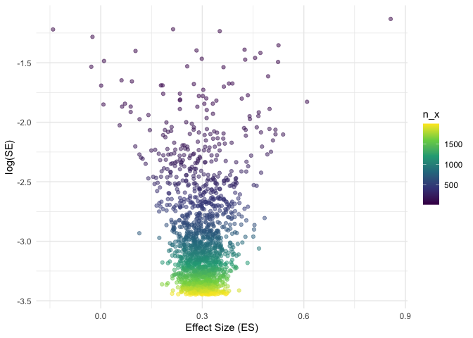
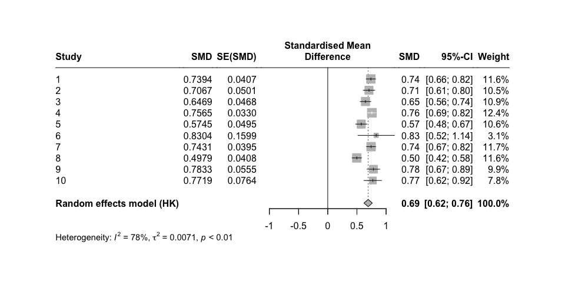

<!-- README.md is generated from README.Rmd. Please edit that file -->

# metafun

<!-- badges: start -->
<!-- badges: end -->

metafun provides useful functions to teach and understand statistical
concept related to Meta-Analyses.

## Installation

You can install the development version of metafun from
[GitHub](https://github.com/) with:

``` r
# install.packages("devtools")
devtools::install_github("simschaefer/metafun")
```

## Example

This is a basic example which shows you how to solve a common problem:

``` r
library(metafun)
## basic example code
```

## Simulate Fixed-Effects model

Simulates data of multiple studies using predefined effect sizes and
between study heterogenity ($\tau$).

``` r
sim <- sim_meta(min_obs = 20,
         max_obs = 2000,
         n_studies = 1500,
         es_true = 0.3,
         es = 'SMD',
         fixed = TRUE,
         random = FALSE,
         varnames = c('x', 'y'))

head(sim$data_aggr)
#> # A tibble: 6 × 10
#>   study hedges_g     se mean_x   mean_y  sd_x  sd_y   n_x   n_y      vi
#>   <int>    <dbl>  <dbl>  <dbl>    <dbl> <dbl> <dbl> <int> <int>   <dbl>
#> 1     1   0.295  0.0471  0.289 -0.00147 0.975 0.993   911   911 0.00222
#> 2     2   0.0699 0.186   0.324  0.259   0.889 0.962    58    58 0.0345 
#> 3     3   0.386  0.0438  0.367 -0.0152  0.994 0.985  1061  1061 0.00192
#> 4     4   0.337  0.0530  0.325 -0.0201  1.02  1.03    723   723 0.00281
#> 5     5   0.302  0.0425  0.324  0.0270  0.984 0.976  1118  1118 0.00181
#> 6     6   0.378  0.0716  0.370 -0.0204  0.992 1.07    397   397 0.00513
```

# Effect size and standard error

``` r
require(tidyverse)
#> Loading required package: tidyverse
#> ── Attaching core tidyverse packages ──────────────────────── tidyverse 2.0.0 ──
#> ✔ dplyr     1.1.4     ✔ readr     2.1.4
#> ✔ forcats   1.0.0     ✔ stringr   1.5.0
#> ✔ ggplot2   3.4.4     ✔ tibble    3.2.1
#> ✔ lubridate 1.9.3     ✔ tidyr     1.3.0
#> ✔ purrr     1.0.2     
#> ── Conflicts ────────────────────────────────────────── tidyverse_conflicts() ──
#> ✖ dplyr::filter() masks stats::filter()
#> ✖ dplyr::lag()    masks stats::lag()
#> ℹ Use the conflicted package (<http://conflicted.r-lib.org/>) to force all conflicts to become errors

ggplot(sim$data_aggr, aes(x = hedges_g, y = log(se), color = n_x))+
  geom_point(alpha = 0.5)+
  theme_minimal()+
  labs(x = "Effect Size (ES)",
       y = "log(SE)")+
  scale_color_viridis_c()
```



# Run Meta-Analysis on simulated data

``` r
require(meta)
#> Loading required package: meta
#> Loading required package: metadat
#> Loading 'meta' package (version 7.0-0).
#> Type 'help(meta)' for a brief overview.
#> Readers of 'Meta-Analysis with R (Use R!)' should install
#> older version of 'meta' package: https://tinyurl.com/dt4y5drs

metaanalysis <- metagen(TE = hedges_g,
                 seTE = se,
                 studlab = study,
                 data = sim$data_aggr %>% filter(study <= 10),
                 sm = "SMD",
                 fixed = TRUE,
                 random = FALSE,
                 title = "Meta-Analysis fixed-effect")

summary(metaanalysis)
#> Review:     Meta-Analysis fixed-effect
#> 
#>       SMD            95%-CI %W(common)
#> 1  0.2952 [ 0.2028; 0.3875]       12.5
#> 2  0.0699 [-0.2942; 0.4340]        0.8
#> 3  0.3863 [ 0.3004; 0.4721]       14.5
#> 4  0.3372 [ 0.2334; 0.4410]        9.9
#> 5  0.3024 [ 0.2190; 0.3858]       15.4
#> 6  0.3783 [ 0.2379; 0.5186]        5.4
#> 7  0.3535 [ 0.2130; 0.4941]        5.4
#> 8  0.2563 [ 0.1692; 0.3434]       14.1
#> 9  0.2730 [ 0.1895; 0.3564]       15.3
#> 10 0.2169 [ 0.0912; 0.3427]        6.8
#> 
#> Number of studies: k = 10
#> 
#>                        SMD           95%-CI     z  p-value
#> Common effect model 0.3053 [0.2726; 0.3380] 18.32 < 0.0001
#> 
#> Quantifying heterogeneity:
#>  tau^2 = 0.0004 [0.0000; 0.0137]; tau = 0.0189 [0.0000; 0.1169]
#>  I^2 = 15.2% [0.0%; 56.5%]; H = 1.09 [1.00; 1.52]
#> 
#> Test of heterogeneity:
#>      Q d.f. p-value
#>  10.61    9  0.3032
#> 
#> Details on meta-analytical method:
#> - Inverse variance method
#> - Restricted maximum-likelihood estimator for tau^2
#> - Q-Profile method for confidence interval of tau^2 and tau
```

# Forest plot

``` r
forest(metaanalysis)
```

 \#
Simulate Random-Effects model

``` r
sim <- sim_meta(min_obs = 20,
         max_obs = 2000,
         n_studies = 1500,
         es_true = 0.7,
         es = 'SMD',
         fixed = FALSE,
         random = TRUE,
         tau = 0.05,
         varnames = c('x', 'y'))

head(sim$data_aggr)
#> # A tibble: 6 × 10
#>   study hedges_g     se mean_x   mean_y  sd_x  sd_y   n_x   n_y      vi
#>   <int>    <dbl>  <dbl>  <dbl>    <dbl> <dbl> <dbl> <int> <int>   <dbl>
#> 1     1    0.732 0.0501  0.658 -0.0807  1.03  0.983   850   850 0.00251
#> 2     2    0.764 0.0459  0.766 -0.00137 0.974 1.03   1020  1020 0.00210
#> 3     3    0.681 0.0828  0.559 -0.141   1.02  1.03    309   309 0.00685
#> 4     4    0.723 0.0347  0.659 -0.0605  0.993 0.997  1772  1772 0.00120
#> 5     5    0.741 0.0582  0.719 -0.0147  1.00  0.976   631   631 0.00339
#> 6     6    0.834 0.0379  0.776 -0.0644  0.991 1.02   1512  1512 0.00144
```

Run Random-Effects Meta-Analysis

``` r
require(meta)
require(metafor)
#> Loading required package: metafor
#> Loading required package: Matrix
#> 
#> Attaching package: 'Matrix'
#> The following objects are masked from 'package:tidyr':
#> 
#>     expand, pack, unpack
#> Loading required package: numDeriv
#> 
#> Loading the 'metafor' package (version 4.4-0). For an
#> introduction to the package please type: help(metafor)

metaanalysis <- metagen(TE = hedges_g,
                 seTE = se,
                 studlab = study,
                 data = sim$data_aggr %>% filter(study <= 10),
                 sm = "SMD",
                 fixed = FALSE,
                 random = TRUE,
                 method.tau = 'PM',
                 method.random.ci = "HK",
                 title = "Meta-Analysis fixed-effect")

summary(metaanalysis)
#> Review:     Meta-Analysis fixed-effect
#> 
#>       SMD           95%-CI %W(random)
#> 1  0.7316 [0.6334; 0.8298]        9.5
#> 2  0.7644 [0.6745; 0.8543]       10.5
#> 3  0.6815 [0.5193; 0.8437]        4.5
#> 4  0.7232 [0.6552; 0.7912]       14.0
#> 5  0.7412 [0.6272; 0.8553]        7.8
#> 6  0.8342 [0.7599; 0.9085]       12.9
#> 7  0.7267 [0.6626; 0.7908]       14.8
#> 8  0.6378 [0.4853; 0.7903]        5.0
#> 9  0.8427 [0.7589; 0.9265]       11.4
#> 10 0.6830 [0.5855; 0.7805]        9.6
#> 
#> Number of studies: k = 10
#> 
#>                              SMD           95%-CI     t  p-value
#> Random effects model (HK) 0.7482 [0.7042; 0.7922] 38.46 < 0.0001
#> 
#> Quantifying heterogeneity:
#>  tau^2 = 0.0015 [0.0000; 0.0109]; tau = 0.0387 [0.0000; 0.1042]
#>  I^2 = 42.2% [0.0%; 72.3%]; H = 1.31 [1.00; 1.90]
#> 
#> Test of heterogeneity:
#>      Q d.f. p-value
#>  15.56    9  0.0766
#> 
#> Details on meta-analytical method:
#> - Inverse variance method
#> - Paule-Mandel estimator for tau^2
#> - Q-Profile method for confidence interval of tau^2 and tau
#> - Hartung-Knapp adjustment for random effects model (df = 9)

metafor::forest(metaanalysis, header = TRUE)
```


