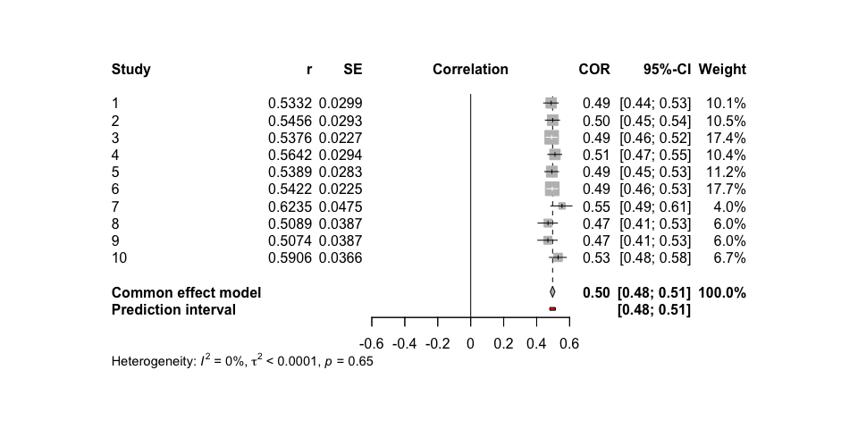

<!-- README.md is generated from README.Rmd. Please edit that file -->

# metafun

<!-- badges: start -->
<!-- badges: end -->

‘metafun’ offers valuable functions for teaching and understanding
statistical concepts related to meta-analyses using a simulation-based
approach. Please note that this package is currently under development,
and full functionality is not yet available.

## Installation

You can install the development version of metafun from
[GitHub](https://github.com/) with:

``` r
# install.packages("devtools")
devtools::install_github("simschaefer/metafun")
```

Load package in R:

``` r
require(metafun)
#> Loading required package: metafun
```

# Standardized Mean Differences

## Fixed Effect Model

### Simulate Data

Simulates data of multiple studies using predefined effect sizes and
between study heterogenity ($\tau$).

``` r
sim <- sim_meta(min_obs = 20,
         max_obs = 2000,
         n_studies = 1500,
         smd_true = 0.3,
         r_true = 0,
         random = FALSE,
         metaregression = FALSE)

head(sim)
#> # A tibble: 6 × 14
#>   study hedges_g         z         r   se_g   se_z    mean1 mean2   sd1   sd2
#>   <int>    <dbl>     <dbl>     <dbl>  <dbl>  <dbl>    <dbl> <dbl> <dbl> <dbl>
#> 1     1    0.322  0.00643   0.00643  0.0346 0.0243  0.00297 0.329 1.01  1.02 
#> 2     2    0.303 -0.0295   -0.0295   0.0332 0.0234 -0.00744 0.289 0.981 0.976
#> 3     3    0.301  0.0150    0.0150   0.0496 0.0349 -0.0135  0.288 1.02  0.984
#> 4     4    0.335 -0.00168  -0.00168  0.0334 0.0234 -0.0316  0.307 1.00  1.02 
#> 5     5    0.361 -0.000592 -0.000592 0.0330 0.0231 -0.0268  0.328 0.973 0.990
#> 6     6    0.296 -0.00420  -0.00420  0.0611 0.0431 -0.00601 0.290 1.01  0.988
#> # ℹ 4 more variables: n1 <int>, n2 <int>, n <int>, variance_g <dbl>
```

### Effect size and standard error

``` r
require(tidyverse)

ggplot(sim, aes(x = hedges_g, y = log(se_g), color = n1))+
  geom_point(alpha = 0.5)+
  theme_minimal()+
  labs(x = "Effect Size (ES)",
       y = "log(SE)")+
  scale_color_viridis_c()
```


### Run Meta-Analysis on simulated data

``` r
require(meta)

#select only studies 1-10 for better readability
sim <- sim %>% 
  filter(study <= 10)

meta_fixed <- metagen(TE = hedges_g,
                 seTE = se_g,
                 studlab = study,
                 data = sim,
                 sm = "SMD",
                 fixed = TRUE,
                 random = FALSE,
                 title = "Meta-Analysis Fixed effect")

summary(meta_fixed)
#> Review:     Meta-Analysis Fixed effect
#> 
#>       SMD           95%-CI %W(common)
#> 1  0.3225 [0.2546; 0.3903]       12.5
#> 2  0.3033 [0.2382; 0.3683]       13.6
#> 3  0.3011 [0.2039; 0.3982]        6.1
#> 4  0.3353 [0.2699; 0.4007]       13.5
#> 5  0.3613 [0.2966; 0.4259]       13.8
#> 6  0.2963 [0.1765; 0.4162]        4.0
#> 7  0.3503 [0.2753; 0.4254]       10.2
#> 8  0.2592 [0.1829; 0.3356]        9.9
#> 9  0.3180 [0.2438; 0.3923]       10.4
#> 10 0.3987 [0.3007; 0.4967]        6.0
#> 
#> Number of studies: k = 10
#> 
#>                        SMD           95%-CI     z  p-value
#> Common effect model 0.3253 [0.3013; 0.3493] 26.57 < 0.0001
#> 
#> Quantifying heterogeneity:
#>  tau^2 = 0 [0.0000; 0.0032]; tau = 0 [0.0000; 0.0563]
#>  I^2 = 0.0% [0.0%; 62.4%]; H = 1.00 [1.00; 1.63]
#> 
#> Test of heterogeneity:
#>     Q d.f. p-value
#>  7.69    9  0.5658
#> 
#> Details on meta-analytical method:
#> - Inverse variance method
#> - Restricted maximum-likelihood estimator for tau^2
#> - Q-Profile method for confidence interval of tau^2 and tau
```

### Forest plot

``` r
metafor::forest(meta_fixed,
             prediction = TRUE, 
             print.tau2 = TRUE,
             leftlabs = c("Study", "g", "SE"))
```


## Random-Effects model Standardized Mean Difference

### Simulate Data

``` r
sim <- sim_meta(min_obs = 200,
         max_obs = 2000,
         n_studies = 10,
         smd_true = 0.7,
         random = TRUE,
         random_effects = c('SMD'),
         tau = 0.05)

head(sim)
#> # A tibble: 6 × 14
#>   study hedges_g       z       r   se_g   se_z    mean1 mean2   sd1   sd2    n1
#>   <int>    <dbl>   <dbl>   <dbl>  <dbl>  <dbl>    <dbl> <dbl> <dbl> <dbl> <int>
#> 1     1    0.728  0.0398  0.0398 0.0397 0.0272 -0.0218  0.730 1.04  1.03   1352
#> 2     2    0.562 -0.0442 -0.0441 0.0616 0.0428  0.0953  0.657 1.02  0.983   548
#> 3     3    0.830  0.0469  0.0469 0.0454 0.0309 -0.0621  0.783 1.03  1.00   1053
#> 4     4    0.697  0.0202  0.0201 0.0478 0.0329  0.0437  0.733 1.00  0.978   927
#> 5     5    0.726  0.0689  0.0688 0.0857 0.0590  0.0336  0.760 0.973 1.03    290
#> 6     6    0.596  0.0305  0.0305 0.0426 0.0295  0.00499 0.607 1.00  1.02   1153
#> # ℹ 3 more variables: n2 <int>, n <int>, variance_g <dbl>
```

### Run Meta-Analysis on simulated data

``` r
require(meta)
require(metafor)

meta_random <- metagen(TE = hedges_g,
                 seTE = se_g,
                 studlab = study,
                 data = sim,
                 sm = "SMD",
                 fixed = FALSE,
                 random = TRUE,
                 method.tau = 'REML',
                 method.random.ci = "HK",
                 title = "Meta-Analysis Random Effects")

summary(meta_random)
#> Review:     Meta-Analysis Random Effects
#> 
#>       SMD           95%-CI %W(random)
#> 1  0.7282 [0.6504; 0.8061]       11.0
#> 2  0.5616 [0.4409; 0.6823]        9.0
#> 3  0.8302 [0.7412; 0.9192]       10.5
#> 4  0.6966 [0.6029; 0.7904]       10.3
#> 5  0.7256 [0.5575; 0.8936]        7.0
#> 6  0.5960 [0.5126; 0.6795]       10.8
#> 7  0.7815 [0.6593; 0.9038]        8.9
#> 8  0.8422 [0.7747; 0.9098]       11.5
#> 9  0.7021 [0.6135; 0.7907]       10.5
#> 10 0.5700 [0.4774; 0.6626]       10.4
#> 
#> Number of studies: k = 10
#> 
#>                              SMD           95%-CI     t  p-value
#> Random effects model (HK) 0.7050 [0.6316; 0.7783] 21.74 < 0.0001
#> 
#> Quantifying heterogeneity:
#>  tau^2 = 0.0083 [0.0026; 0.0317]; tau = 0.0911 [0.0513; 0.1780]
#>  I^2 = 80.0% [64.0%; 88.9%]; H = 2.24 [1.67; 3.00]
#> 
#> Test of heterogeneity:
#>      Q d.f.  p-value
#>  44.97    9 < 0.0001
#> 
#> Details on meta-analytical method:
#> - Inverse variance method
#> - Restricted maximum-likelihood estimator for tau^2
#> - Q-Profile method for confidence interval of tau^2 and tau
#> - Hartung-Knapp adjustment for random effects model (df = 9)


metafor::forest(meta_random,
             prediction = TRUE, 
             print.tau2 = TRUE,
             leftlabs = c("Study", "g", "SE"))
```


# Correlations

## Fixed Effect Model

### Simulate data

Simulates data of multiple studies using predefined effect sizes and
between study heterogenity ($\tau$).

``` r
sim <- sim_meta(min_obs = 200,
         max_obs = 2000,
         n_studies = 10,
         smd_true = 0,
         r_true = 0.5,
         random = FALSE)

head(sim)
#> # A tibble: 6 × 14
#>   study hedges_g     z     r   se_g   se_z    mean1    mean2   sd1   sd2    n1
#>   <int>    <dbl> <dbl> <dbl>  <dbl>  <dbl>    <dbl>    <dbl> <dbl> <dbl> <int>
#> 1     1   0.0269 0.548 0.499 0.0427 0.0302 -0.0510  -0.0244  1.00  0.975  1099
#> 2     2  -0.0142 0.540 0.493 0.0433 0.0306 -0.0241  -0.0383  0.989 0.994  1068
#> 3     3  -0.0134 0.601 0.538 0.0696 0.0494  0.0409   0.0276  1.02  0.962   413
#> 4     4  -0.0506 0.495 0.458 0.0791 0.0562  0.0532   0.00479 0.965 0.947   320
#> 5     5   0.0535 0.559 0.507 0.0397 0.0281 -0.0164   0.0381  1.04  1.00   1267
#> 6     6   0.0134 0.567 0.513 0.0401 0.0284  0.00666  0.0201  1.02  0.996  1244
#> # ℹ 3 more variables: n2 <int>, n <int>, variance_g <dbl>
```

### Run Meta-Analysis on simulated data

``` r
require(meta)

meta_fixed <- metagen(TE = z,
                 seTE = se_z,
                 studlab = study,
                 data = sim,
                 sm = "ZCOR",
                 fixed = TRUE,
                 random = FALSE,
                 title = "Meta-Analysis Fixed effect")

summary(meta_fixed)
#> Review:     Meta-Analysis Fixed effect
#> 
#>       COR           95%-CI %W(common)
#> 1  0.4989 [0.4531; 0.5421]       11.4
#> 2  0.4933 [0.4466; 0.5374]       11.1
#> 3  0.5379 [0.4656; 0.6031]        4.3
#> 4  0.4582 [0.3670; 0.5407]        3.3
#> 5  0.5070 [0.4649; 0.5468]       13.2
#> 6  0.5134 [0.4712; 0.5532]       12.9
#> 7  0.4931 [0.4519; 0.5321]       14.2
#> 8  0.4872 [0.4428; 0.5292]       12.5
#> 9  0.4735 [0.3974; 0.5432]        4.5
#> 10 0.5224 [0.4802; 0.5622]       12.6
#> 
#> Number of studies: k = 10
#> 
#>                        COR           95%-CI     z p-value
#> Common effect model 0.5012 [0.4861; 0.5161] 53.98       0
#> 
#> Quantifying heterogeneity:
#>  tau^2 = 0 [0.0000; 0.0011]; tau = 0 [0.0000; 0.0334]
#>  I^2 = 0.0% [0.0%; 62.4%]; H = 1.00 [1.00; 1.63]
#> 
#> Test of heterogeneity:
#>     Q d.f. p-value
#>  4.71    9  0.8591
#> 
#> Details on meta-analytical method:
#> - Inverse variance method
#> - Restricted maximum-likelihood estimator for tau^2
#> - Q-Profile method for confidence interval of tau^2 and tau
#> - Fisher's z transformation of correlations
```

### Forest plot

``` r
metafor::forest(meta_fixed,
             prediction = TRUE, 
             print.tau2 = TRUE,
             leftlabs = c("Study", "r", "SE"))
```



## Random Effects Model

### Simulate data

``` r
sim <- sim_meta(min_obs = 200,
         max_obs = 2000,
         n_studies = 10,
         smd_true = 0,
         r_true = 0.5,
         random = TRUE,
         random_effects = c('ZCOR'),
         tau = 0.1)

head(sim)
#> # A tibble: 6 × 14
#>   study hedges_g     z     r   se_g   se_z    mean1    mean2   sd1   sd2    n1
#>   <int>    <dbl> <dbl> <dbl>  <dbl>  <dbl>    <dbl>    <dbl> <dbl> <dbl> <int>
#> 1     1  0.00436 0.570 0.516 0.0420 0.0297  0.0444   0.0486  0.981 0.972  1135
#> 2     2  0.103   0.257 0.251 0.0821 0.0583 -0.0161   0.0818  0.930 0.970   297
#> 3     3 -0.00220 0.788 0.657 0.0390 0.0276 -0.00351 -0.00572 0.984 1.03   1317
#> 4     4 -0.00717 0.373 0.356 0.0401 0.0284  0.0441   0.0370  1.01  0.985  1242
#> 5     5  0.00142 0.385 0.367 0.0438 0.0310  0.0188   0.0203  1.02  0.993  1042
#> 6     6 -0.0199  0.663 0.581 0.0814 0.0578 -0.0342  -0.0540  1.01  0.972   302
#> # ℹ 3 more variables: n2 <int>, n <int>, variance_g <dbl>
```

### Run Meta-Analysis on simulated data

``` r

meta_random <- metagen(TE = z,
                 seTE = se_z,
                 studlab = study,
                 data = sim,
                 sm = "ZCOR",
                 fixed = FALSE,
                 random = TRUE,
                 method.tau = 'REML',
                 method.random.ci = "HK",
                 title = "Meta-Analysis Random Effects")

summary(meta_random)
#> Review:     Meta-Analysis Random Effects
#> 
#>       COR           95%-CI %W(random)
#> 1  0.5155 [0.4715; 0.5570]       10.2
#> 2  0.2514 [0.1416; 0.3550]        9.3
#> 3  0.6573 [0.6255; 0.6869]       10.2
#> 4  0.3562 [0.3067; 0.4038]       10.2
#> 5  0.3670 [0.3133; 0.4184]       10.1
#> 6  0.5806 [0.5005; 0.6508]        9.3
#> 7  0.4360 [0.3968; 0.4735]       10.3
#> 8  0.5077 [0.4725; 0.5414]       10.3
#> 9  0.4562 [0.3927; 0.5153]        9.9
#> 10 0.6180 [0.5836; 0.6501]       10.2
#> 
#> Number of studies: k = 10
#> 
#>                              COR           95%-CI     t  p-value
#> Random effects model (HK) 0.4848 [0.3893; 0.5699] 10.12 < 0.0001
#> 
#> Quantifying heterogeneity:
#>  tau^2 = 0.0257 [0.0115; 0.0906]; tau = 0.1603 [0.1071; 0.3010]
#>  I^2 = 96.0% [94.2%; 97.2%]; H = 4.99 [4.15; 6.01]
#> 
#> Test of heterogeneity:
#>       Q d.f.  p-value
#>  224.36    9 < 0.0001
#> 
#> Details on meta-analytical method:
#> - Inverse variance method
#> - Restricted maximum-likelihood estimator for tau^2
#> - Q-Profile method for confidence interval of tau^2 and tau
#> - Hartung-Knapp adjustment for random effects model (df = 9)
#> - Fisher's z transformation of correlations


metafor::forest(meta_random,
             prediction = TRUE, 
             print.tau2 = TRUE,
             leftlabs = c("Study", "r", "SE"))
```


# Subgroup-Analysis Standardized Mean Difference

### Simulate Data

``` r
sim <- sim_meta(min_obs = 200,
         max_obs = 2000,
         n_studies = 30,
         smd_true = 0.2,
         r_true = 0,
         random = TRUE,
         tau = 0.1,
         random_effects = c('SMD'),
         metaregression = TRUE,
         smd_mod_effects = c(0.1,0.2,0.3),
         r_mod_effects = c(0,0,0),
         mod_labels = c('group1', 'group2', 'group3'))

head(sim %>% 
       select(study, hedges_g, subgroups, everything()))
#> # A tibble: 6 × 19
#>   study hedges_g subgroups         z        r   se_g   se_z    mean1 mean2   sd1
#>   <int>    <dbl> <chr>         <dbl>    <dbl>  <dbl>  <dbl>    <dbl> <dbl> <dbl>
#> 1     1    0.181 group2     0.00521   5.21e-3 0.0595 0.0421  0.238   0.417 0.997
#> 2     2    0.513 group3     0.000135  1.35e-4 0.0407 0.0284  0.0531  0.568 0.970
#> 3     3    0.179 group1     0.0620    6.19e-2 0.0608 0.0430  0.136   0.310 1.00 
#> 4     4    0.275 group2     0.0501    5.01e-2 0.0368 0.0259 -0.00818 0.270 1.03 
#> 5     5    0.545 group3    -0.0383   -3.82e-2 0.0393 0.0273 -0.0289  0.526 1.00 
#> 6     6    0.273 group1    -0.0369   -3.69e-2 0.0614 0.0433  0.0101  0.286 0.996
#> # ℹ 9 more variables: sd2 <dbl>, n1 <int>, n2 <int>, n <int>,
#> #   smd_mod_effects <dbl>, r_mod_effects <dbl>, r_true <dbl>, smd_true <dbl>,
#> #   variance_g <dbl>
```

### Run Meta-Analysis on simulated data

``` r
meta_random <- metagen(TE = hedges_g,
                 seTE = se_g,
                 studlab = study,
                 data = sim,
                 sm = "SMD",
                 fixed = FALSE,
                 random = TRUE,
                 method.tau = 'REML',
                 method.random.ci = "HK",
                 subgroup = subgroups,
                 title = "Meta-Analysis Random Effects")

summary(meta_random)
#> Review:     Meta-Analysis Random Effects
#> 
#>       SMD            95%-CI %W(random) subgroups
#> 1  0.1811 [ 0.0646; 0.2977]        3.3    group2
#> 2  0.5130 [ 0.4333; 0.5928]        3.5    group3
#> 3  0.1788 [ 0.0597; 0.2978]        3.2    group1
#> 4  0.2745 [ 0.2023; 0.3467]        3.5    group2
#> 5  0.5453 [ 0.4682; 0.6224]        3.5    group3
#> 6  0.2727 [ 0.1524; 0.3930]        3.2    group1
#> 7  0.2606 [ 0.1968; 0.3244]        3.6    group2
#> 8  0.7001 [ 0.5254; 0.8749]        2.8    group2
#> 9  0.5456 [ 0.4781; 0.6132]        3.6    group3
#> 10 0.6573 [ 0.5918; 0.7227]        3.6    group3
#> 11 0.4196 [ 0.3147; 0.5246]        3.3    group2
#> 12 0.5493 [ 0.4525; 0.6461]        3.4    group3
#> 13 0.4086 [ 0.3363; 0.4809]        3.5    group2
#> 14 0.3058 [ 0.1464; 0.4652]        2.9    group2
#> 15 0.2194 [ 0.1375; 0.3013]        3.5    group2
#> 16 0.3471 [ 0.2796; 0.4145]        3.6    group2
#> 17 0.4427 [ 0.2505; 0.6350]        2.6    group3
#> 18 0.5122 [ 0.3849; 0.6394]        3.2    group1
#> 19 0.2307 [ 0.1367; 0.3248]        3.4    group3
#> 20 0.4486 [ 0.3445; 0.5527]        3.3    group2
#> 21 0.6801 [ 0.5986; 0.7615]        3.5    group2
#> 22 0.5585 [ 0.4814; 0.6356]        3.5    group1
#> 23 0.4470 [ 0.3609; 0.5331]        3.5    group1
#> 24 0.5904 [ 0.4454; 0.7355]        3.0    group3
#> 25 0.4830 [ 0.3725; 0.5935]        3.3    group2
#> 26 0.2794 [ 0.2118; 0.3470]        3.6    group3
#> 27 0.1190 [-0.0049; 0.2430]        3.2    group2
#> 28 0.2289 [ 0.1556; 0.3021]        3.5    group1
#> 29 0.4361 [ 0.3376; 0.5346]        3.4    group1
#> 30 0.4401 [ 0.2722; 0.6081]        2.8    group3
#> 
#> Number of studies: k = 30
#> 
#>                              SMD           95%-CI     t  p-value
#> Random effects model (HK) 0.4081 [0.3485; 0.4678] 14.00 < 0.0001
#> 
#> Quantifying heterogeneity:
#>  tau^2 = 0.0226 [0.0133; 0.0432]; tau = 0.1504 [0.1153; 0.2079]
#>  I^2 = 91.5% [89.0%; 93.5%]; H = 3.44 [3.02; 3.92]
#> 
#> Test of heterogeneity:
#>       Q d.f.  p-value
#>  343.07   29 < 0.0001
#> 
#> Results for subgroups (random effects model (HK)):
#>                      k    SMD           95%-CI  tau^2    tau      Q   I^2
#> subgroups = group2  13 0.3703 [0.2653; 0.4752] 0.0264 0.1625 134.58 91.1%
#> subgroups = group3  10 0.4804 [0.3814; 0.5793] 0.0172 0.1313 100.27 91.0%
#> subgroups = group1   7 0.3775 [0.2405; 0.5145] 0.0193 0.1390  58.63 89.8%
#> 
#> Test for subgroup differences (random effects model (HK)):
#>                   Q d.f. p-value
#> Between groups 3.54    2  0.1705
#> 
#> Details on meta-analytical method:
#> - Inverse variance method
#> - Restricted maximum-likelihood estimator for tau^2
#> - Q-Profile method for confidence interval of tau^2 and tau
#> - Hartung-Knapp adjustment for random effects model (df = 29)


metafor::forest(meta_random,
             prediction = TRUE, 
             print.tau2 = TRUE,
             leftlabs = c("Study", "g", "SE"))
```


# Metaregression

## Simulate Data

``` r

# define values of moderator variable:
x <- 1:100/100

# define slope:
b <- -0.5

df <- sim_meta(min_obs = 1000,
               max_obs = 2000,
               n_studies = 30,
               smd_true = 0,
               r_true = 0,
               random = TRUE,
               tau = 0.1,
               random_effects = c('SMD'),
               metaregression = TRUE,
               mod_name = 'moderator',
               smd_mod_effects = b*x,
               r_mod_effects = rep(0,100),
               mod_labels = x)

# show correlation between moderator and effect size
ggplot(df, aes(moderator,hedges_g))+
  geom_point()+
  geom_smooth(method = 'lm')
#> `geom_smooth()` using formula = 'y ~ x'
```


``` r

mg <- metagen(TE = hedges_g,
              seTE = se_g,
              studlab = study,
              data = df,
              sm = "SMD",
              fixed = FALSE,
              random = TRUE,
              method.tau = 'REML',
              title = "Meta-Analysis fixed-effect",
              tau.common = FALSE)

m.gen.reg <- metareg(mg, ~moderator)

summary(m.gen.reg)
#> 
#> Mixed-Effects Model (k = 30; tau^2 estimator: REML)
#> 
#>   logLik  deviance       AIC       BIC      AICc   
#>  12.0443  -24.0886  -18.0886  -14.0919  -17.0886   
#> 
#> tau^2 (estimated amount of residual heterogeneity):     0.0232 (SE = 0.0066)
#> tau (square root of estimated tau^2 value):             0.1524
#> I^2 (residual heterogeneity / unaccounted variability): 94.39%
#> H^2 (unaccounted variability / sampling variability):   17.83
#> R^2 (amount of heterogeneity accounted for):            51.05%
#> 
#> Test for Residual Heterogeneity:
#> QE(df = 28) = 466.9975, p-val < .0001
#> 
#> Test of Moderators (coefficient 2):
#> QM(df = 1) = 29.3641, p-val < .0001
#> 
#> Model Results:
#> 
#>            estimate      se     zval    pval    ci.lb    ci.ub      
#> intrcpt      0.0074  0.0629   0.1181  0.9060  -0.1158   0.1306      
#> moderator   -0.5642  0.1041  -5.4189  <.0001  -0.7683  -0.3601  *** 
#> 
#> ---
#> Signif. codes:  0 '***' 0.001 '**' 0.01 '*' 0.05 '.' 0.1 ' ' 1

bubble(m.gen.reg, studlab = TRUE)
```


