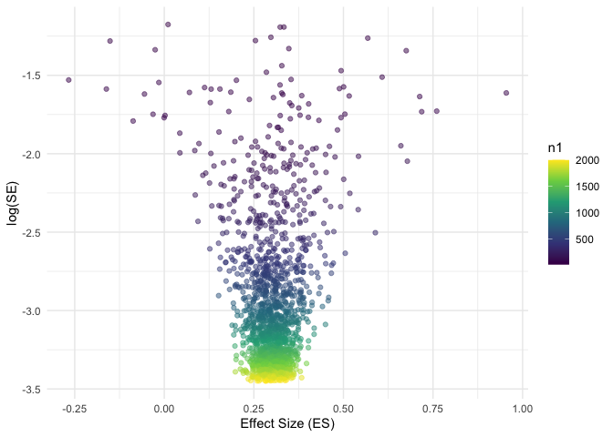

<!-- README.md is generated from README.Rmd. Please edit that file -->

# metafun

<!-- badges: start -->
<!-- badges: end -->

‘metafun’ offers valuable functions for teaching and understanding
statistical concepts related to meta-analyses using a simulation-based
approach. Please note that this package is currently under development,
and full functionality is not yet available.

## Installation

You can install the development version of metafun from
[GitHub](https://github.com/) with:

``` r
# install.packages("devtools")
devtools::install_github("simschaefer/metafun")
```

Load package in R:

``` r
require(metafun)
#> Loading required package: metafun
```

# Fixed-Effects model Standardized Mean Difference

## Simulate data

Simulates data of multiple studies using predefined effect sizes and
between study heterogenity ($\tau$).

``` r
sim <- sim_meta(min_obs = 20,
         max_obs = 2000,
         n_studies = 1500,
         smd_true = 0.3,
         r_true = 0,
         es = 'SMD',
         random = FALSE)

head(sim)
#> # A tibble: 6 × 10
#>   study hedges_g     se  mean_x mean_y  sd_x  sd_y   n_x   n_y      vi
#>   <int>    <dbl>  <dbl>   <dbl>  <dbl> <dbl> <dbl> <int> <int>   <dbl>
#> 1     1    0.310 0.0434  0.0109  0.316 0.995 0.975  1073  1073 0.00189
#> 2     2    0.357 0.0447 -0.0363  0.323 1.01  0.999  1019  1019 0.00199
#> 3     3    0.290 0.0373 -0.0199  0.266 0.992 0.984  1455  1455 0.00139
#> 4     4    0.275 0.0605  0.0120  0.278 0.983 0.945   552   552 0.00366
#> 5     5    0.251 0.0561  0.0156  0.277 1.01  1.06    640   640 0.00315
#> 6     6    0.291 0.0503  0.0121  0.302 0.979 1.01    798   798 0.00253
```

## Effect size and standard error

``` r
require(tidyverse)

ggplot(sim, aes(x = hedges_g, y = log(se), color = n_x))+
  geom_point(alpha = 0.5)+
  theme_minimal()+
  labs(x = "Effect Size (ES)",
       y = "log(SE)")+
  scale_color_viridis_c()
```



## Run Meta-Analysis on simulated data

``` r
require(meta)

# choose only studies 1-10 for better readability
analysis_data <- sim %>% 
  filter(study <= 10)

meta_fixed <- metagen(TE = hedges_g,
                 seTE = se,
                 studlab = study,
                 data = analysis_data,
                 sm = "SMD",
                 fixed = TRUE,
                 random = FALSE,
                 title = "Meta-Analysis Fixed effect")

summary(meta_fixed)
#> Review:     Meta-Analysis Fixed effect
#> 
#>       SMD           95%-CI %W(common)
#> 1  0.3096 [0.2245; 0.3948]       11.1
#> 2  0.3571 [0.2696; 0.4447]       10.5
#> 3  0.2896 [0.2165; 0.3626]       15.1
#> 4  0.2752 [0.1567; 0.3937]        5.7
#> 5  0.2514 [0.1414; 0.3614]        6.7
#> 6  0.2912 [0.1925; 0.3898]        8.3
#> 7  0.4333 [0.2904; 0.5762]        4.0
#> 8  0.3126 [0.2341; 0.3910]       13.1
#> 9  0.2299 [0.1521; 0.3077]       13.4
#> 10 0.2298 [0.1478; 0.3119]       12.0
#> 
#> Number of studies: k = 10
#> 
#>                        SMD           95%-CI     z  p-value
#> Common effect model 0.2893 [0.2608; 0.3177] 19.95 < 0.0001
#> 
#> Quantifying heterogeneity:
#>  tau^2 = 0.0004 [0.0000; 0.0091]; tau = 0.0192 [0.0000; 0.0954]
#>  I^2 = 22.0% [0.0%; 61.8%]; H = 1.13 [1.00; 1.62]
#> 
#> Test of heterogeneity:
#>      Q d.f. p-value
#>  11.54    9  0.2407
#> 
#> Details on meta-analytical method:
#> - Inverse variance method
#> - Restricted maximum-likelihood estimator for tau^2
#> - Q-Profile method for confidence interval of tau^2 and tau
```

## Forest plot

``` r
metafor::forest(meta_fixed,
             prediction = TRUE, 
             print.tau2 = TRUE,
             leftlabs = c("Study", "g", "SE"))
```


# Random-Effects model Standardized Mean Difference

## Simulate data

``` r
sim <- sim_meta(min_obs = 20,
         max_obs = 2000,
         n_studies = 1500,
         smd_true = 0.7,
         es = 'SMD',
         random = TRUE,
         tau = 0.05)

head(sim)
#> # A tibble: 6 × 10
#>   study hedges_g     se   mean_x mean_y  sd_x  sd_y   n_x   n_y      vi
#>   <int>    <dbl>  <dbl>    <dbl>  <dbl> <dbl> <dbl> <int> <int>   <dbl>
#> 1     1    0.723 0.0359  0.00427  0.740 1.00  1.03   1652  1652 0.00129
#> 2     2    0.681 0.0600 -0.0229   0.677 1.04  1.01    588   588 0.00360
#> 3     3    0.667 0.0375 -0.0307   0.641 1.01  1.01   1501  1501 0.00141
#> 4     4    0.626 0.0463  0.0892   0.722 0.978 1.04    978   978 0.00215
#> 5     5    0.733 0.0345 -0.0226   0.721 1.01  1.01   1794  1794 0.00119
#> 6     6    0.647 0.0380  0.0534   0.696 0.991 0.995  1459  1459 0.00144
```

## Run Meta-Analysis on simulated data

``` r
require(meta)
require(metafor)

# choose only studies 1-10 for better readability
analysis_data <- sim %>% 
  filter(study <= 10)

meta_random <- metagen(TE = hedges_g,
                 seTE = se,
                 studlab = study,
                 data = analysis_data,
                 sm = "SMD",
                 fixed = FALSE,
                 random = TRUE,
                 method.tau = 'PM',
                 method.random.ci = "HK",
                 title = "Meta-Analysis Random Effects")

summary(meta_random)
#> Review:     Meta-Analysis Random Effects
#> 
#>       SMD           95%-CI %W(random)
#> 1  0.7234 [0.6530; 0.7938]       11.8
#> 2  0.6814 [0.5638; 0.7990]        7.8
#> 3  0.6674 [0.5939; 0.7409]       11.5
#> 4  0.6258 [0.5350; 0.7165]        9.9
#> 5  0.7330 [0.6654; 0.8006]       12.1
#> 6  0.6468 [0.5724; 0.7213]       11.4
#> 7  0.7312 [0.6511; 0.8114]       10.9
#> 8  0.7621 [0.6658; 0.8585]        9.4
#> 9  0.4758 [0.2563; 0.6953]        3.3
#> 10 0.8058 [0.7364; 0.8752]       11.9
#> 
#> Number of studies: k = 10
#> 
#>                              SMD           95%-CI     t  p-value
#> Random effects model (HK) 0.7025 [0.6509; 0.7541] 30.79 < 0.0001
#> 
#> Quantifying heterogeneity:
#>  tau^2 = 0.0031 [0.0002; 0.0209]; tau = 0.0559 [0.0156; 0.1444]
#>  I^2 = 57.7% [14.6%; 79.0%]; H = 1.54 [1.08; 2.18]
#> 
#> Test of heterogeneity:
#>      Q d.f. p-value
#>  21.27    9  0.0115
#> 
#> Details on meta-analytical method:
#> - Inverse variance method
#> - Paule-Mandel estimator for tau^2
#> - Q-Profile method for confidence interval of tau^2 and tau
#> - Hartung-Knapp adjustment for random effects model (df = 9)


metafor::forest(meta_random,
             prediction = TRUE, 
             print.tau2 = TRUE,
             leftlabs = c("Study", "g", "SE"))
```


