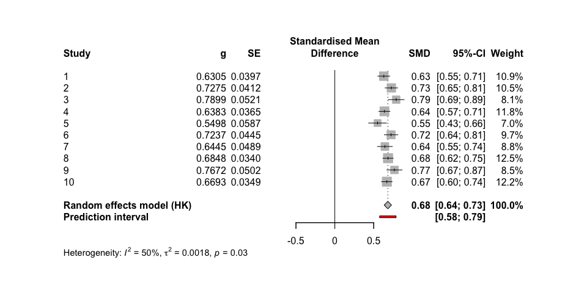
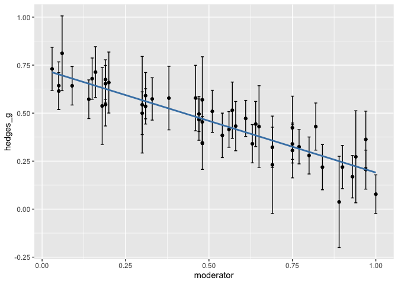

<!-- README.md is generated from README.Rmd. Please edit that file -->

# metafun

<!-- badges: start -->
<!-- badges: end -->

‘metafun’ offers valuable functions for teaching and understanding
statistical concepts related to meta-analyses using a simulation-based
approach. Please note that this package is currently under development,
and full functionality is not yet available.

## Installation

You can install the development version of metafun from
[GitHub](https://github.com/) with:

``` r
# install.packages("devtools")
devtools::install_github("simschaefer/metafun")
```

Load package in R:

``` r
require(metafun)
#> Loading required package: metafun
```

# Standardized Mean Differences

## Fixed Effect Model

### Simulate Data

Simulates data of multiple studies using predefined effect sizes and
between study heterogenity ($\tau$).

``` r
sim <- sim_meta(min_obs = 20,
         max_obs = 2000,
         n_studies = 1500,
         smd_true = 0.3,
         r_true = 0,
         random = FALSE,
         metaregression = FALSE)

head(sim)
#> # A tibble: 6 × 14
#>   study hedges_g        z        r   se_g   se_z    mean1 mean2   sd1   sd2
#>   <int>    <dbl>    <dbl>    <dbl>  <dbl>  <dbl>    <dbl> <dbl> <dbl> <dbl>
#> 1     1    0.341 -0.0654  -0.0653  0.0527 0.0371 -0.0263  0.309 0.980 0.981
#> 2     2    0.404  0.00462  0.00462 0.193  0.139  -0.0419  0.362 1.03  0.956
#> 3     3    0.307 -0.0370  -0.0370  0.0388 0.0273  0.00216 0.306 0.977 1.01 
#> 4     4    0.262 -0.0366  -0.0366  0.0438 0.0309  0.0228  0.289 1.03  1.00 
#> 5     5    0.382  0.0342   0.0342  0.0342 0.0240 -0.0293  0.348 0.971 1.00 
#> 6     6    0.304 -0.00413 -0.00413 0.0488 0.0344  0.0144  0.325 1.01  1.04 
#> # ℹ 4 more variables: n1 <int>, n2 <int>, n <int>, variance_g <dbl>
```

### Effect size and standard error

``` r
require(tidyverse)

ggplot(sim, aes(x = hedges_g, y = log(se_g), color = n1))+
  geom_point(alpha = 0.5)+
  theme_minimal()+
  labs(x = "Effect Size (ES)",
       y = "log(SE)")+
  scale_color_viridis_c()
```


### Run Meta-Analysis on simulated data

``` r
require(meta)
#> Warning in check_dep_version(): ABI version mismatch: 
#> lme4 was built with Matrix ABI version 1
#> Current Matrix ABI version is 0
#> Please re-install lme4 from source or restore original 'Matrix' package

#select only studies 1-10 for better readability
sim <- sim %>% 
  filter(study <= 10)

meta_fixed <- metagen(TE = hedges_g,
                 seTE = se_g,
                 studlab = study,
                 data = sim,
                 sm = "SMD",
                 fixed = TRUE,
                 random = FALSE,
                 title = "Meta-Analysis Fixed effect")

summary(meta_fixed)
#> Review:     Meta-Analysis Fixed effect
#> 
#>       SMD           95%-CI %W(common)
#> 1  0.3415 [0.2381; 0.4448]        8.6
#> 2  0.4045 [0.0269; 0.7820]        0.6
#> 3  0.3065 [0.2305; 0.3826]       15.8
#> 4  0.2623 [0.1764; 0.3482]       12.4
#> 5  0.3821 [0.3151; 0.4492]       20.4
#> 6  0.3039 [0.2083; 0.3996]       10.0
#> 7  0.3543 [0.2438; 0.4648]        7.5
#> 8  0.3859 [0.2144; 0.5574]        3.1
#> 9  0.3697 [0.2895; 0.4498]       14.3
#> 10 0.2702 [0.1579; 0.3826]        7.3
#> 
#> Number of studies: k = 10
#> 
#>                        SMD           95%-CI     z  p-value
#> Common effect model 0.3322 [0.3020; 0.3625] 21.52 < 0.0001
#> 
#> Quantifying heterogeneity:
#>  tau^2 = 0.0003 [0.0000; 0.0042]; tau = 0.0185 [0.0000; 0.0647]
#>  I^2 = 0.0% [0.0%; 62.4%]; H = 1.00 [1.00; 1.63]
#> 
#> Test of heterogeneity:
#>     Q d.f. p-value
#>  8.16    9  0.5179
#> 
#> Details on meta-analytical method:
#> - Inverse variance method
#> - Restricted maximum-likelihood estimator for tau^2
#> - Q-Profile method for confidence interval of tau^2 and tau
```

### Forest plot

``` r
metafor::forest(meta_fixed,
             prediction = TRUE, 
             print.tau2 = TRUE,
             leftlabs = c("Study", "g", "SE"))
```


## Random-Effects model Standardized Mean Difference

### Simulate Data

``` r
sim <- sim_meta(min_obs = 200,
         max_obs = 2000,
         n_studies = 10,
         smd_true = 0.7,
         random = TRUE,
         random_effects = c('SMD'),
         tau = 0.05)

head(sim)
#> # A tibble: 6 × 14
#>   study hedges_g        z        r   se_g   se_z    mean1 mean2   sd1   sd2
#>   <int>    <dbl>    <dbl>    <dbl>  <dbl>  <dbl>    <dbl> <dbl> <dbl> <dbl>
#> 1     1    0.674  0.00533  0.00533 0.0447 0.0308 -0.0207  0.664 1.03  1.00 
#> 2     2    0.781  0.0148   0.0148  0.0473 0.0323 -0.0370  0.742 1.00  0.990
#> 3     3    0.696 -0.0212  -0.0212  0.0529 0.0364  0.0289  0.732 0.997 1.02 
#> 4     4    0.648  0.0270   0.0270  0.0444 0.0306  0.00883 0.657 1.01  0.993
#> 5     5    0.652  0.0104   0.0104  0.0372 0.0257  0.0151  0.676 1.01  1.01 
#> 6     6    0.600 -0.0241  -0.0240  0.0515 0.0357 -0.00257 0.619 1.04  1.03 
#> # ℹ 4 more variables: n1 <int>, n2 <int>, n <int>, variance_g <dbl>
```

### Run Meta-Analysis on simulated data

``` r
require(meta)
require(metafor)

meta_random <- metagen(TE = hedges_g,
                 seTE = se_g,
                 studlab = study,
                 data = sim,
                 sm = "SMD",
                 fixed = FALSE,
                 random = TRUE,
                 method.tau = 'REML',
                 method.random.ci = "HK",
                 title = "Meta-Analysis Random Effects")

summary(meta_random)
#> Review:     Meta-Analysis Random Effects
#> 
#>       SMD           95%-CI %W(random)
#> 1  0.6743 [0.5867; 0.7619]       10.6
#> 2  0.7810 [0.6883; 0.8736]       10.0
#> 3  0.6963 [0.5925; 0.8000]        8.8
#> 4  0.6479 [0.5609; 0.7348]       10.7
#> 5  0.6523 [0.5794; 0.7253]       12.6
#> 6  0.6002 [0.4992; 0.7012]        9.1
#> 7  0.7907 [0.7124; 0.8689]       11.9
#> 8  0.6987 [0.6001; 0.7974]        9.3
#> 9  0.7906 [0.6044; 0.9768]        3.8
#> 10 0.7307 [0.6607; 0.8008]       13.1
#> 
#> Number of studies: k = 10
#> 
#>                              SMD           95%-CI     t  p-value
#> Random effects model (HK) 0.7025 [0.6571; 0.7478] 35.05 < 0.0001
#> 
#> Quantifying heterogeneity:
#>  tau^2 = 0.0019 [0.0000; 0.0115]; tau = 0.0431 [0.0000; 0.1072]
#>  I^2 = 46.4% [0.0%; 74.2%]; H = 1.37 [1.00; 1.97]
#> 
#> Test of heterogeneity:
#>      Q d.f. p-value
#>  16.80    9  0.0519
#> 
#> Details on meta-analytical method:
#> - Inverse variance method
#> - Restricted maximum-likelihood estimator for tau^2
#> - Q-Profile method for confidence interval of tau^2 and tau
#> - Hartung-Knapp adjustment for random effects model (df = 9)


metafor::forest(meta_random,
             prediction = TRUE, 
             print.tau2 = TRUE,
             leftlabs = c("Study", "g", "SE"))
```



# Correlations

## Fixed Effect Model

### Simulate data

Simulates data of multiple studies using predefined effect sizes and
between study heterogenity ($\tau$).

``` r
sim <- sim_meta(min_obs = 200,
         max_obs = 2000,
         n_studies = 10,
         smd_true = 0,
         r_true = 0.5,
         random = FALSE)

head(sim)
#> # A tibble: 6 × 14
#>   study  hedges_g     z     r   se_g   se_z    mean1     mean2   sd1   sd2    n1
#>   <int>     <dbl> <dbl> <dbl>  <dbl>  <dbl>    <dbl>     <dbl> <dbl> <dbl> <int>
#> 1     1  0.0249   0.585 0.526 0.0377 0.0267 -0.0139   0.0115   1.01  1.03   1406
#> 2     2 -0.0442   0.591 0.531 0.0469 0.0332  0.0156  -0.0290   1.00  1.01    911
#> 3     3  0.000291 0.619 0.550 0.0358 0.0254 -0.0367  -0.0364   1.02  1.02   1558
#> 4     4  0.0144   0.540 0.493 0.0595 0.0422 -0.0183  -0.00409  1.01  0.960   565
#> 5     5 -0.0415   0.592 0.531 0.0836 0.0594  0.0491   0.00840  0.976 0.984   286
#> 6     6  0.00861  0.604 0.540 0.0391 0.0277 -0.00825  0.000307 1.00  0.981  1305
#> # ℹ 3 more variables: n2 <int>, n <int>, variance_g <dbl>
```

### Run Meta-Analysis on simulated data

``` r
require(meta)

meta_fixed <- metagen(TE = z,
                 seTE = se_z,
                 studlab = study,
                 data = sim,
                 sm = "ZCOR",
                 fixed = TRUE,
                 random = FALSE,
                 title = "Meta-Analysis Fixed effect")

summary(meta_fixed)
#> Review:     Meta-Analysis Fixed effect
#> 
#>       COR           95%-CI %W(common)
#> 1  0.5265 [0.4876; 0.5632]       12.4
#> 2  0.5308 [0.4825; 0.5759]        8.0
#> 3  0.5504 [0.5148; 0.5841]       13.7
#> 4  0.4928 [0.4277; 0.5528]        5.0
#> 5  0.5313 [0.4426; 0.6097]        2.5
#> 6  0.5401 [0.5005; 0.5774]       11.5
#> 7  0.4941 [0.4507; 0.5351]       10.9
#> 8  0.5002 [0.4601; 0.5383]       12.5
#> 9  0.4866 [0.4515; 0.5202]       16.8
#> 10 0.5451 [0.4932; 0.5931]        6.7
#> 
#> Number of studies: k = 10
#> 
#>                        COR           95%-CI     z p-value
#> Common effect model 0.5183 [0.5047; 0.5316] 61.06       0
#> 
#> Quantifying heterogeneity:
#>  tau^2 = 0.0004 [0.0000; 0.0027]; tau = 0.0206 [0.0000; 0.0517]
#>  I^2 = 26.0% [0.0%; 64.3%]; H = 1.16 [1.00; 1.67]
#> 
#> Test of heterogeneity:
#>      Q d.f. p-value
#>  12.17    9  0.2041
#> 
#> Details on meta-analytical method:
#> - Inverse variance method
#> - Restricted maximum-likelihood estimator for tau^2
#> - Q-Profile method for confidence interval of tau^2 and tau
#> - Fisher's z transformation of correlations
```

### Forest plot

``` r
metafor::forest(meta_fixed,
             prediction = TRUE, 
             print.tau2 = TRUE,
             leftlabs = c("Study", "r", "SE"))
```


## Random Effects Model

### Simulate data

``` r
sim <- sim_meta(min_obs = 200,
         max_obs = 2000,
         n_studies = 10,
         smd_true = 0,
         r_true = 0.5,
         random = TRUE,
         random_effects = c('ZCOR'),
         tau = 0.1)

head(sim)
#> # A tibble: 6 × 14
#>   study hedges_g     z     r   se_g   se_z    mean1    mean2   sd1   sd2    n1
#>   <int>    <dbl> <dbl> <dbl>  <dbl>  <dbl>    <dbl>    <dbl> <dbl> <dbl> <int>
#> 1     1 -0.00436 0.516 0.474 0.0409 0.0289  0.0485   0.0441  1.02  0.983  1198
#> 2     2 -0.0821  0.385 0.367 0.0525 0.0372  0.00989 -0.0715  1.00  0.979   727
#> 3     3 -0.0156  0.492 0.456 0.0538 0.0382  0.0551   0.0395  0.983 1.02    690
#> 4     4  0.0437  0.406 0.385 0.0368 0.0260 -0.00354  0.0404  1.02  0.992  1478
#> 5     5  0.00487 0.441 0.415 0.0320 0.0227 -0.0345  -0.0297  1.00  0.988  1948
#> 6     6  0.0430  0.338 0.326 0.0470 0.0333 -0.0396   0.00439 1.01  1.03    904
#> # ℹ 3 more variables: n2 <int>, n <int>, variance_g <dbl>
```

### Run Meta-Analysis on simulated data

``` r

meta_random <- metagen(TE = z,
                 seTE = se_z,
                 studlab = study,
                 data = sim,
                 sm = "ZCOR",
                 fixed = FALSE,
                 random = TRUE,
                 method.tau = 'REML',
                 method.random.ci = "HK",
                 title = "Meta-Analysis Random Effects")

summary(meta_random)
#> Review:     Meta-Analysis Random Effects
#> 
#>       COR           95%-CI %W(random)
#> 1  0.4745 [0.4294; 0.5172]       10.1
#> 2  0.3670 [0.3023; 0.4283]        9.8
#> 3  0.4561 [0.3950; 0.5133]        9.8
#> 4  0.3847 [0.3404; 0.4273]       10.1
#> 5  0.4148 [0.3773; 0.4509]       10.2
#> 6  0.3255 [0.2660; 0.3826]        9.9
#> 7  0.5436 [0.4809; 0.6007]        9.6
#> 8  0.6142 [0.5749; 0.6508]       10.0
#> 9  0.2377 [0.1958; 0.2787]       10.2
#> 10 0.5725 [0.5404; 0.6029]       10.2
#> 
#> Number of studies: k = 10
#> 
#>                              COR           95%-CI     t  p-value
#> Random effects model (HK) 0.4455 [0.3568; 0.5261] 10.24 < 0.0001
#> 
#> Quantifying heterogeneity:
#>  tau^2 = 0.0210 [0.0094; 0.0716]; tau = 0.1449 [0.0970; 0.2676]
#>  I^2 = 96.6% [95.2%; 97.6%]; H = 5.43 [4.56; 6.47]
#> 
#> Test of heterogeneity:
#>       Q d.f.  p-value
#>  265.54    9 < 0.0001
#> 
#> Details on meta-analytical method:
#> - Inverse variance method
#> - Restricted maximum-likelihood estimator for tau^2
#> - Q-Profile method for confidence interval of tau^2 and tau
#> - Hartung-Knapp adjustment for random effects model (df = 9)
#> - Fisher's z transformation of correlations


metafor::forest(meta_random,
             prediction = TRUE, 
             print.tau2 = TRUE,
             leftlabs = c("Study", "r", "SE"))
```


# Subgroup-Analysis Standardized Mean Difference

### Simulate Data

``` r
sim <- sim_meta(min_obs = 200,
         max_obs = 2000,
         n_studies = 30,
         smd_true = 0.2,
         r_true = 0,
         random = TRUE,
         tau = 0.1,
         random_effects = c('SMD'),
         metaregression = TRUE,
         smd_mod_effects = c(0.1,0.2,0.3),
         r_mod_effects = c(0,0,0),
         mod_labels = c('group1', 'group2', 'group3'))

head(sim %>% 
       select(study, hedges_g, subgroups, everything()))
#> # A tibble: 6 × 19
#>   study hedges_g subgroups        z        r   se_g   se_z   mean1 mean2   sd1
#>   <int>    <dbl> <chr>        <dbl>    <dbl>  <dbl>  <dbl>   <dbl> <dbl> <dbl>
#> 1     1    0.311 group3    -0.0122  -0.0122  0.0596 0.0420 -0.0235 0.301 1.02 
#> 2     2    0.466 group2    -0.0384  -0.0384  0.0338 0.0236  0.0160 0.473 0.986
#> 3     3    0.397 group2    -0.00118 -0.00118 0.0428 0.0300 -0.0275 0.360 0.969
#> 4     4    0.390 group2     0.00948  0.00948 0.0450 0.0316  0.0501 0.447 1.01 
#> 5     5    0.758 group3     0.0185   0.0185  0.0388 0.0265 -0.0316 0.714 0.983
#> 6     6    0.241 group2     0.0414   0.0414  0.0796 0.0563  0.0176 0.265 0.984
#> # ℹ 9 more variables: sd2 <dbl>, n1 <int>, n2 <int>, n <int>,
#> #   smd_mod_effects <dbl>, r_mod_effects <dbl>, r_true <dbl>, smd_true <dbl>,
#> #   variance_g <dbl>
```

### Run Meta-Analysis on simulated data

``` r
meta_random <- metagen(TE = hedges_g,
                 seTE = se_g,
                 studlab = study,
                 data = sim,
                 sm = "SMD",
                 fixed = FALSE,
                 random = TRUE,
                 method.tau = 'REML',
                 method.random.ci = "HK",
                 subgroup = subgroups,
                 title = "Meta-Analysis Random Effects")

summary(meta_random)
#> Review:     Meta-Analysis Random Effects
#> 
#>       SMD           95%-CI %W(random) subgroups
#> 1  0.3114 [0.1946; 0.4282]        3.1    group3
#> 2  0.4663 [0.4001; 0.5326]        3.5    group2
#> 3  0.3975 [0.3137; 0.4813]        3.4    group2
#> 4  0.3900 [0.3018; 0.4782]        3.3    group2
#> 5  0.7576 [0.6816; 0.8336]        3.4    group3
#> 6  0.2409 [0.0849; 0.3969]        2.8    group2
#> 7  0.3655 [0.2949; 0.4360]        3.5    group2
#> 8  0.3100 [0.2436; 0.3765]        3.5    group1
#> 9  0.2447 [0.1174; 0.3721]        3.0    group1
#> 10 0.3586 [0.2754; 0.4417]        3.4    group3
#> 11 0.3291 [0.2445; 0.4138]        3.4    group3
#> 12 0.4025 [0.3282; 0.4768]        3.4    group3
#> 13 0.5942 [0.5234; 0.6651]        3.4    group1
#> 14 0.4014 [0.3270; 0.4757]        3.4    group2
#> 15 0.2554 [0.1723; 0.3385]        3.4    group1
#> 16 0.2168 [0.1138; 0.3197]        3.2    group2
#> 17 0.5059 [0.4232; 0.5886]        3.4    group3
#> 18 0.2004 [0.0884; 0.3123]        3.2    group2
#> 19 0.1615 [0.0787; 0.2443]        3.4    group1
#> 20 0.3208 [0.2414; 0.4002]        3.4    group1
#> 21 0.4608 [0.3874; 0.5342]        3.4    group2
#> 22 0.5011 [0.4102; 0.5919]        3.3    group3
#> 23 0.6665 [0.5882; 0.7447]        3.4    group3
#> 24 0.4141 [0.3488; 0.4793]        3.5    group1
#> 25 0.3240 [0.2593; 0.3886]        3.5    group2
#> 26 0.2006 [0.1199; 0.2814]        3.4    group1
#> 27 0.1377 [0.0462; 0.2293]        3.3    group1
#> 28 0.5900 [0.4459; 0.7342]        2.9    group1
#> 29 0.3839 [0.3173; 0.4504]        3.5    group2
#> 30 0.2585 [0.1810; 0.3361]        3.4    group1
#> 
#> Number of studies: k = 30
#> 
#>                              SMD           95%-CI     t  p-value
#> Random effects model (HK) 0.3737 [0.3182; 0.4292] 13.76 < 0.0001
#> 
#> Quantifying heterogeneity:
#>  tau^2 = 0.0200 [0.0120; 0.0380]; tau = 0.1414 [0.1094; 0.1949]
#>  I^2 = 91.7% [89.2%; 93.6%]; H = 3.46 [3.04; 3.94]
#> 
#> Test of heterogeneity:
#>       Q d.f.  p-value
#>  347.86   29 < 0.0001
#> 
#> Results for subgroups (random effects model (HK)):
#>                      k    SMD           95%-CI  tau^2    tau      Q   I^2
#> subgroups = group3   8 0.4808 [0.3448; 0.6169] 0.0246 0.1568 104.90 93.3%
#> subgroups = group2  11 0.3594 [0.2997; 0.4191] 0.0054 0.0736  37.21 73.1%
#> subgroups = group1  11 0.3153 [0.2118; 0.4187] 0.0212 0.1454 122.85 91.9%
#> 
#> Test for subgroup differences (random effects model (HK)):
#>                   Q d.f. p-value
#> Between groups 5.24    2  0.0728
#> 
#> Details on meta-analytical method:
#> - Inverse variance method
#> - Restricted maximum-likelihood estimator for tau^2
#> - Q-Profile method for confidence interval of tau^2 and tau
#> - Hartung-Knapp adjustment for random effects model (df = 29)


metafor::forest(meta_random,
             prediction = TRUE, 
             print.tau2 = TRUE,
             leftlabs = c("Study", "g", "SE"))
```


# Metaregression

## Simulate Data

``` r
# define values of moderator variable:
x <- 1:100/100

# define slope:
b <- -0.5

df <- sim_meta(min_obs = 100,
               max_obs = 1000,
               n_studies = 50,
               smd_true = 0,
               r_true = 0,
               random = FALSE,
               metaregression = TRUE,
               mod_name = 'moderator',
               smd_mod_effects = b*x,
               r_mod_effects = rep(0,100),
               mod_labels = x)

# show correlation between moderator and effect size
df %>% 
  mutate(g_upper = hedges_g + 1.96*se_g,
         g_lower = hedges_g - 1.96*se_g) %>% 
ggplot(aes(moderator,hedges_g))+
  geom_point()+
  geom_errorbar(aes(ymin = g_lower, ymax = g_upper))+
  geom_smooth(method = 'lm', se = FALSE, color = 'steelblue')
#> `geom_smooth()` using formula = 'y ~ x'
```



``` r

mg <- metagen(TE = hedges_g,
              seTE = se_g,
              studlab = study,
              data = df,
              sm = "SMD",
              fixed = TRUE,
              random = FALSE,
              method.tau = 'REML',
              title = "Meta-Analysis fixed-effect",
              tau.common = FALSE)

m.gen.reg <- metareg(mg, ~moderator)

summary(m.gen.reg)
#> 
#> Mixed-Effects Model (k = 50; tau^2 estimator: REML)
#> 
#>    logLik   deviance        AIC        BIC       AICc   
#>   66.2050  -132.4101  -126.4101  -120.7965  -125.8646   
#> 
#> tau^2 (estimated amount of residual heterogeneity):     0 (SE = 0.0007)
#> tau (square root of estimated tau^2 value):             0
#> I^2 (residual heterogeneity / unaccounted variability): 0.00%
#> H^2 (unaccounted variability / sampling variability):   1.00
#> R^2 (amount of heterogeneity accounted for):            100.00%
#> 
#> Test for Residual Heterogeneity:
#> QE(df = 48) = 45.0776, p-val = 0.5933
#> 
#> Test of Moderators (coefficient 2):
#> QM(df = 1) = 239.1606, p-val < .0001
#> 
#> Model Results:
#> 
#>            estimate      se      zval    pval    ci.lb    ci.ub      
#> intrcpt      0.0052  0.0184    0.2806  0.7791  -0.0310   0.0413      
#> moderator   -0.4888  0.0316  -15.4648  <.0001  -0.5507  -0.4268  *** 
#> 
#> ---
#> Signif. codes:  0 '***' 0.001 '**' 0.01 '*' 0.05 '.' 0.1 ' ' 1

bubble(m.gen.reg, studlab = TRUE)
```


# Multiple Metaregression

Simulate data

``` r
data <- sim_metareg(random = TRUE,
                    tau = 0.1,
                    n_studies = 50,
                    formula = y ~ 0.1*group + 0.05*quality + 0.2*control,
                    mod_types = c('cat', 'cont', 'cat'))

head(data)
#> 
#>    hedges_g   n         se intercept group     quality control         m     yi 
#> 1 0.7439242 210 0.06826181 0.5355452     0  0.16757996       1 0.7395551 0.7396 
#> 2 0.8493109 382 0.05170782 0.5692468     1 -0.39871983       1 0.7832067 0.7832 
#> 3 0.5828988 269 0.05807034 0.5181114     1 -0.70425082       0 0.6032126 0.6032 
#> 4 0.6040520 430 0.04669550 0.6083729     0 -0.08641726       0 0.5091886 0.5092 
#> 5 0.6730491 129 0.08037438 0.5237068     0 -1.01315256       1 0.6724710 0.6725 
#> 6 0.7280351 397 0.05504017 0.5675450     0 -0.79019843       1 0.7357255 0.7357 
#>       vi 
#> 1 0.0047 
#> 2 0.0027 
#> 3 0.0034 
#> 4 0.0022 
#> 5 0.0065 
#> 6 0.0030
```

Conduct Meta-Analysis

``` r
meta <- rma(yi = hedges_g,
            sei = se,
            data = data,
            mods = ~ group + quality +control)

summary(meta)
#> 
#> Mixed-Effects Model (k = 50; tau^2 estimator: REML)
#> 
#>   logLik  deviance       AIC       BIC      AICc   
#>  41.8855  -83.7710  -73.7710  -64.6278  -72.2710   
#> 
#> tau^2 (estimated amount of residual heterogeneity):     0.0058 (SE = 0.0020)
#> tau (square root of estimated tau^2 value):             0.0761
#> I^2 (residual heterogeneity / unaccounted variability): 62.43%
#> H^2 (unaccounted variability / sampling variability):   2.66
#> R^2 (amount of heterogeneity accounted for):            70.94%
#> 
#> Test for Residual Heterogeneity:
#> QE(df = 46) = 123.8642, p-val < .0001
#> 
#> Test of Moderators (coefficients 2:4):
#> QM(df = 3) = 76.9326, p-val < .0001
#> 
#> Model Results:
#> 
#>          estimate      se     zval    pval   ci.lb   ci.ub      
#> intrcpt    0.5039  0.0247  20.3899  <.0001  0.4555  0.5523  *** 
#> group      0.1112  0.0283   3.9256  <.0001  0.0557  0.1667  *** 
#> quality    0.0577  0.0148   3.8927  <.0001  0.0286  0.0867  *** 
#> control    0.1966  0.0287   6.8479  <.0001  0.1403  0.2528  *** 
#> 
#> ---
#> Signif. codes:  0 '***' 0.001 '**' 0.01 '*' 0.05 '.' 0.1 ' ' 1
```
