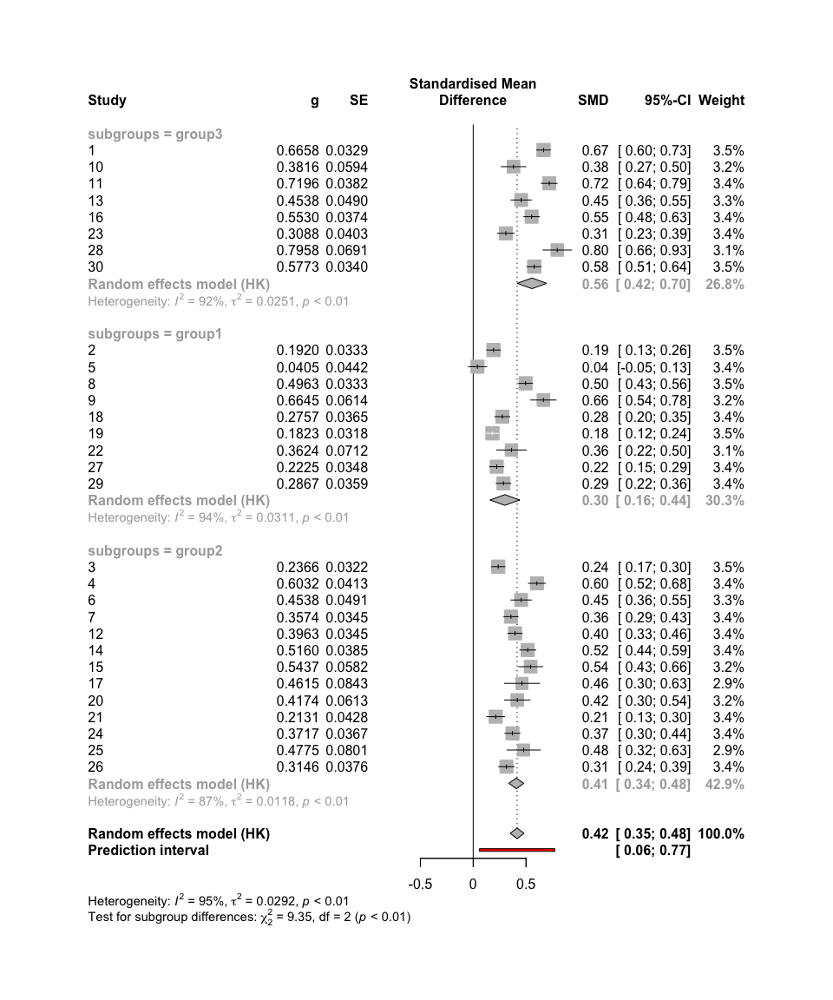

<!-- README.md is generated from README.Rmd. Please edit that file -->

# metafun

<!-- badges: start -->
<!-- badges: end -->

‘metafun’ offers valuable functions for teaching and understanding
statistical concepts related to meta-analyses using a simulation-based
approach. Please note that this package is currently under development,
and full functionality is not yet available.

## Installation

You can install the development version of metafun from
[GitHub](https://github.com/) with:

``` r
# install.packages("devtools")
devtools::install_github("simschaefer/metafun")
```

Load package in R:

``` r
require(metafun)
#> Loading required package: metafun
```

# Standardized Mean Differences

## Fixed Effect Model

### Simulate data

Simulates data of multiple studies using predefined effect sizes and
between study heterogenity ($\tau$).

``` r
sim <- sim_meta(min_obs = 20,
         max_obs = 2000,
         n_studies = 1500,
         smd_true = 0.3,
         r_true = 0,
         es = 'SMD',
         random = FALSE)

head(sim)
#> # A tibble: 6 × 10
#>   study hedges_g     se   mean_x mean_y  sd_x  sd_y   n_x   n_y      vi
#>   <int>    <dbl>  <dbl>    <dbl>  <dbl> <dbl> <dbl> <int> <int>   <dbl>
#> 1     1    0.271 0.0472 -0.0395   0.241 1.02  1.05    907   907 0.00223
#> 2     2    0.277 0.0328  0.0377   0.313 0.994 0.996  1881  1881 0.00107
#> 3     3    0.169 0.0898  0.0290   0.195 0.986 0.972   249   249 0.00806
#> 4     4    0.296 0.0345  0.0207   0.316 0.978 1.02   1694  1694 0.00119
#> 5     5    0.292 0.0436 -0.0375   0.251 0.982 0.996  1061  1061 0.00191
#> 6     6    0.300 0.0444 -0.00320  0.300 1.01  1.01   1026  1026 0.00197
```

### Effect size and standard error

``` r
require(tidyverse)

ggplot(sim, aes(x = hedges_g, y = log(se), color = n_x))+
  geom_point(alpha = 0.5)+
  theme_minimal()+
  labs(x = "Effect Size (ES)",
       y = "log(SE)")+
  scale_color_viridis_c()
```


### Run Meta-Analysis on simulated data

``` r
require(meta)

#select only studies 1-10 for better readability
sim <- sim %>% 
  filter(study <= 10)

meta_fixed <- metagen(TE = hedges_g,
                 seTE = se,
                 studlab = study,
                 data = sim,
                 sm = "SMD",
                 fixed = TRUE,
                 random = FALSE,
                 title = "Meta-Analysis Fixed effect")

summary(meta_fixed)
#> Review:     Meta-Analysis Fixed effect
#> 
#>       SMD            95%-CI %W(common)
#> 1  0.2708 [ 0.1784; 0.3633]        8.9
#> 2  0.2768 [ 0.2126; 0.3410]       18.5
#> 3  0.1689 [-0.0071; 0.3449]        2.5
#> 4  0.2956 [ 0.2279; 0.3633]       16.7
#> 5  0.2916 [ 0.2061; 0.3772]       10.4
#> 6  0.3002 [ 0.2132; 0.3872]       10.1
#> 7  0.2117 [-0.2027; 0.6260]        0.4
#> 8  0.2565 [ 0.1886; 0.3245]       16.6
#> 9  0.2962 [ 0.2139; 0.3784]       11.3
#> 10 0.2380 [ 0.1084; 0.3675]        4.6
#> 
#> Number of studies: k = 10
#> 
#>                        SMD           95%-CI     z  p-value
#> Common effect model 0.2774 [0.2498; 0.3051] 19.67 < 0.0001
#> 
#> Quantifying heterogeneity:
#>  tau^2 = 0 [0.0000; 0.0005]; tau = 0 [0.0000; 0.0219]
#>  I^2 = 0.0% [0.0%; 62.4%]; H = 1.00 [1.00; 1.63]
#> 
#> Test of heterogeneity:
#>     Q d.f. p-value
#>  3.14    9  0.9584
#> 
#> Details on meta-analytical method:
#> - Inverse variance method
#> - Restricted maximum-likelihood estimator for tau^2
#> - Q-Profile method for confidence interval of tau^2 and tau
```

### Forest plot

``` r
metafor::forest(meta_fixed,
             prediction = TRUE, 
             print.tau2 = TRUE,
             leftlabs = c("Study", "g", "SE"))
```


## Random-Effects model Standardized Mean Difference

### Simulate data

``` r
sim <- sim_meta(min_obs = 200,
         max_obs = 2000,
         n_studies = 10,
         smd_true = 0.7,
         es = 'SMD',
         random = TRUE,
         tau = 0.05)

head(sim)
#> # A tibble: 6 × 10
#>   study hedges_g     se   mean_x mean_y  sd_x  sd_y   n_x   n_y      vi
#>   <int>    <dbl>  <dbl>    <dbl>  <dbl> <dbl> <dbl> <int> <int>   <dbl>
#> 1     1    0.625 0.0873  0.0706   0.703 1.01  1.01    275   275 0.00763
#> 2     2    0.612 0.0346  0.0604   0.674 0.994 1.01   1746  1746 0.00120
#> 3     3    0.770 0.0346 -0.0219   0.745 0.975 1.02   1793  1793 0.00120
#> 4     4    0.695 0.0503 -0.0422   0.665 1.04  0.992   837   837 0.00253
#> 5     5    0.650 0.0497  0.0877   0.728 0.989 0.982   851   851 0.00247
#> 6     6    0.723 0.0478 -0.00241  0.712 0.998 0.978   931   931 0.00229
```

### Run Meta-Analysis on simulated data

``` r
require(meta)
require(metafor)

meta_random <- metagen(TE = hedges_g,
                 seTE = se,
                 studlab = study,
                 data = sim,
                 sm = "SMD",
                 fixed = FALSE,
                 random = TRUE,
                 method.tau = 'REML',
                 method.random.ci = "HK",
                 title = "Meta-Analysis Random Effects")

summary(meta_random)
#> Review:     Meta-Analysis Random Effects
#> 
#>       SMD           95%-CI %W(random)
#> 1  0.6254 [0.4542; 0.7966]        5.4
#> 2  0.6122 [0.5443; 0.6801]       15.1
#> 3  0.7697 [0.7019; 0.8376]       15.1
#> 4  0.6949 [0.5962; 0.7935]       11.0
#> 5  0.6497 [0.5522; 0.7472]       11.1
#> 6  0.7228 [0.6291; 0.8166]       11.6
#> 7  0.7325 [0.5856; 0.8794]        6.7
#> 8  0.6509 [0.5554; 0.7463]       11.4
#> 9  0.7828 [0.6345; 0.9311]        6.6
#> 10 0.8351 [0.6772; 0.9930]        6.1
#> 
#> Number of studies: k = 10
#> 
#>                              SMD           95%-CI     t  p-value
#> Random effects model (HK) 0.7000 [0.6498; 0.7503] 31.49 < 0.0001
#> 
#> Quantifying heterogeneity:
#>  tau^2 = 0.0023 [0.0000; 0.0140]; tau = 0.0483 [0.0000; 0.1182]
#>  I^2 = 48.9% [0.0%; 75.3%]; H = 1.40 [1.00; 2.01]
#> 
#> Test of heterogeneity:
#>      Q d.f. p-value
#>  17.62    9  0.0398
#> 
#> Details on meta-analytical method:
#> - Inverse variance method
#> - Restricted maximum-likelihood estimator for tau^2
#> - Q-Profile method for confidence interval of tau^2 and tau
#> - Hartung-Knapp adjustment for random effects model (df = 9)


metafor::forest(meta_random,
             prediction = TRUE, 
             print.tau2 = TRUE,
             leftlabs = c("Study", "g", "SE"))
```


# Correlations

## Fixed Effect Model

### Simulate data

Simulates data of multiple studies using predefined effect sizes and
between study heterogenity ($\tau$).

``` r
sim <- sim_meta(min_obs = 200,
         max_obs = 2000,
         n_studies = 10,
         smd_true = 0,
         r_true = 0.5,
         es = 'ZCOR',
         random = FALSE)

head(sim)
#> # A tibble: 6 × 5
#>   study     z     r     n     se
#>   <int> <dbl> <dbl> <int>  <dbl>
#> 1     1 0.546 0.497  1728 0.0241
#> 2     2 0.523 0.480   932 0.0328
#> 3     3 0.510 0.470   395 0.0505
#> 4     4 0.565 0.512  1703 0.0243
#> 5     5 0.605 0.541  1257 0.0282
#> 6     6 0.562 0.510  1290 0.0279
```

### Run Meta-Analysis on simulated data

``` r
require(meta)

meta_fixed <- metagen(TE = z,
                 seTE = se,
                 studlab = study,
                 data = sim,
                 sm = "ZCOR",
                 fixed = TRUE,
                 random = FALSE,
                 title = "Meta-Analysis Fixed effect")

summary(meta_fixed)
#> Review:     Meta-Analysis Fixed effect
#> 
#>       COR           95%-CI %W(common)
#> 1  0.4974 [0.4610; 0.5320]       14.7
#> 2  0.4803 [0.4293; 0.5282]        7.9
#> 3  0.4701 [0.3894; 0.5435]        3.3
#> 4  0.5120 [0.4761; 0.5462]       14.5
#> 5  0.5406 [0.5003; 0.5786]       10.7
#> 6  0.5098 [0.4682; 0.5491]       11.0
#> 7  0.4804 [0.4336; 0.5245]        9.4
#> 8  0.5038 [0.4504; 0.5536]        6.8
#> 9  0.5308 [0.4704; 0.5863]        5.0
#> 10 0.4896 [0.4551; 0.5227]       16.6
#> 
#> Number of studies: k = 10
#> 
#>                        COR           95%-CI     z p-value
#> Common effect model 0.5027 [0.4891; 0.5161] 59.87       0
#> 
#> Quantifying heterogeneity:
#>  tau^2 = 0 [0.0000; 0.0019]; tau = 0 [0.0000; 0.0433]
#>  I^2 = 0.0% [0.0%; 62.4%]; H = 1.00 [1.00; 1.63]
#> 
#> Test of heterogeneity:
#>     Q d.f. p-value
#>  7.82    9  0.5529
#> 
#> Details on meta-analytical method:
#> - Inverse variance method
#> - Restricted maximum-likelihood estimator for tau^2
#> - Q-Profile method for confidence interval of tau^2 and tau
#> - Fisher's z transformation of correlations
```

### Forest plot

``` r
metafor::forest(meta_fixed,
             prediction = TRUE, 
             print.tau2 = TRUE,
             leftlabs = c("Study", "r", "SE"))
```


## Random Effects Model

### Simulate data

``` r
sim <- sim_meta(min_obs = 200,
         max_obs = 2000,
         n_studies = 10,
         smd_true = 0,
         r_true = 0.5,
         es = 'ZCOR',
         random = TRUE,
         tau = 0.1)

head(sim)
#> # A tibble: 6 × 5
#>   study     z     r     n     se
#>   <int> <dbl> <dbl> <int>  <dbl>
#> 1     1 0.305 0.296   861 0.0341
#> 2     2 0.360 0.345  1856 0.0232
#> 3     3 0.370 0.354  1967 0.0226
#> 4     4 0.516 0.474  1816 0.0235
#> 5     5 0.380 0.363  1570 0.0253
#> 6     6 0.510 0.470  1388 0.0269
```

### Run Meta-Analysis on simulated data

``` r

meta_random <- metagen(TE = z,
                 seTE = se,
                 studlab = study,
                 data = sim,
                 sm = "ZCOR",
                 fixed = FALSE,
                 random = TRUE,
                 method.tau = 'REML',
                 method.random.ci = "HK",
                 title = "Meta-Analysis Random Effects")

summary(meta_random)
#> Review:     Meta-Analysis Random Effects
#> 
#>       COR           95%-CI %W(random)
#> 1  0.2959 [0.2337; 0.3557]       10.0
#> 2  0.3450 [0.3043; 0.3845]       10.6
#> 3  0.3539 [0.3146; 0.3920]       10.7
#> 4  0.4743 [0.4378; 0.5092]       10.6
#> 5  0.3631 [0.3193; 0.4053]       10.5
#> 6  0.4701 [0.4281; 0.5101]       10.4
#> 7  0.4041 [0.3636; 0.4431]       10.6
#> 8  0.2984 [0.2103; 0.3817]        9.0
#> 9  0.5481 [0.5057; 0.5879]       10.3
#> 10 0.3920 [0.2688; 0.5026]        7.3
#> 
#> Number of studies: k = 10
#> 
#>                              COR           95%-CI     t  p-value
#> Random effects model (HK) 0.3992 [0.3373; 0.4576] 13.35 < 0.0001
#> 
#> Quantifying heterogeneity:
#>  tau^2 = 0.0090 [0.0037; 0.0320]; tau = 0.0950 [0.0604; 0.1788]
#>  I^2 = 91.0% [85.7%; 94.4%]; H = 3.34 [2.64; 4.23]
#> 
#> Test of heterogeneity:
#>       Q d.f.  p-value
#>  100.51    9 < 0.0001
#> 
#> Details on meta-analytical method:
#> - Inverse variance method
#> - Restricted maximum-likelihood estimator for tau^2
#> - Q-Profile method for confidence interval of tau^2 and tau
#> - Hartung-Knapp adjustment for random effects model (df = 9)
#> - Fisher's z transformation of correlations


metafor::forest(meta_random,
             prediction = TRUE, 
             print.tau2 = TRUE,
             leftlabs = c("Study", "r", "SE"))
```


# Subgroup-Analysis Standardized Mean Difference

### Simulate data

``` r
sim <- sim_meta(min_obs = 200,
         max_obs = 2000,
         n_studies = 30,
         smd_true = 0.2,
         r_true = 0,
         es = 'SMD',
         random = TRUE,
         tau = 0.1,
         metaregression = TRUE,
         mod_varname = c('subgroup'),
         mod_labels = c('group1', 'group2', 'group3'),
         mod_effect = c(0.2, 0.4))

head(sim %>% 
       select(study, hedges_g, subgroup, everything()))
#> # A tibble: 6 × 11
#>   study hedges_g subgroup     se   mean_x mean_y  sd_x  sd_y   n_x   n_y      vi
#>   <int>    <dbl> <chr>     <dbl>    <dbl>  <dbl> <dbl> <dbl> <int> <int>   <dbl>
#> 1     1    0.370 group2   0.0902 -0.0109   0.359 0.976 1.02    250   250 0.00814
#> 2     2    0.435 group2   0.0354 -0.0492   0.386 1.01  0.995  1638  1638 0.00125
#> 3     3    0.166 group2   0.0430  0.332    0.495 0.988 0.975  1083  1083 0.00185
#> 4     4    0.324 group1   0.0377 -0.0265   0.301 1.02  0.997  1422  1422 0.00142
#> 5     5    0.189 group1   0.0714  0.0664   0.253 0.989 0.978   394   394 0.00510
#> 6     6    0.218 group2   0.0487  0.00121  0.222 1.03  0.990   848   848 0.00237
```

### Run Meta-Analysis on simulated data

``` r
meta_random <- metagen(TE = hedges_g,
                 seTE = se,
                 studlab = study,
                 data = sim,
                 sm = "SMD",
                 fixed = FALSE,
                 random = TRUE,
                 method.tau = 'REML',
                 method.random.ci = "HK",
                 subgroup = subgroup,
                 title = "Meta-Analysis Random Effects")

summary(meta_random)
#> Review:     Meta-Analysis Random Effects
#> 
#>       SMD            95%-CI %W(random) subgroup
#> 1  0.3705 [ 0.1937; 0.5473]        3.0   group2
#> 2  0.4349 [ 0.3656; 0.5042]        3.4   group2
#> 3  0.1657 [ 0.0813; 0.2500]        3.4   group2
#> 4  0.3241 [ 0.2501; 0.3980]        3.4   group1
#> 5  0.1894 [ 0.0495; 0.3294]        3.2   group1
#> 6  0.2184 [ 0.1229; 0.3139]        3.3   group2
#> 7  0.1790 [ 0.0841; 0.2738]        3.3   group1
#> 8  0.9167 [ 0.8343; 0.9991]        3.4   group3
#> 9  0.4825 [ 0.4157; 0.5494]        3.4   group2
#> 10 0.0329 [-0.0831; 0.1489]        3.3   group1
#> 11 0.0983 [-0.0028; 0.1994]        3.3   group1
#> 12 0.8072 [ 0.7329; 0.8816]        3.4   group3
#> 13 0.2497 [ 0.1823; 0.3171]        3.4   group1
#> 14 0.2535 [ 0.1769; 0.3301]        3.4   group1
#> 15 0.5440 [ 0.4763; 0.6117]        3.4   group2
#> 16 0.0730 [-0.0203; 0.1663]        3.3   group1
#> 17 0.7317 [ 0.6490; 0.8143]        3.4   group3
#> 18 0.3556 [ 0.2292; 0.4821]        3.2   group2
#> 19 0.0936 [ 0.0220; 0.1652]        3.4   group1
#> 20 0.5071 [ 0.4433; 0.5709]        3.4   group2
#> 21 0.1577 [ 0.0945; 0.2209]        3.4   group1
#> 22 0.7728 [ 0.7070; 0.8385]        3.4   group3
#> 23 0.2391 [ 0.1170; 0.3612]        3.2   group2
#> 24 0.2727 [ 0.1527; 0.3928]        3.3   group2
#> 25 0.1695 [ 0.0850; 0.2540]        3.4   group2
#> 26 0.4096 [ 0.3096; 0.5095]        3.3   group2
#> 27 0.0765 [-0.0078; 0.1608]        3.4   group1
#> 28 0.1310 [ 0.0390; 0.2231]        3.3   group1
#> 29 0.5283 [ 0.4633; 0.5933]        3.4   group2
#> 30 0.7506 [ 0.6638; 0.8374]        3.3   group3
#> 
#> Number of studies: k = 30
#> 
#>                              SMD           95%-CI    t  p-value
#> Random effects model (HK) 0.3525 [0.2597; 0.4453] 7.76 < 0.0001
#> 
#> Quantifying heterogeneity:
#>  tau^2 = 0.0600 [0.0371; 0.1091]; tau = 0.2449 [0.1926; 0.3303]
#>  I^2 = 97.2% [96.7%; 97.7%]; H = 6.01 [5.48; 6.59]
#> 
#> Test of heterogeneity:
#>        Q d.f.  p-value
#>  1047.35   29 < 0.0001
#> 
#> Results for subgroups (random effects model (HK)):
#>                     k    SMD           95%-CI  tau^2    tau      Q   I^2
#> subgroup = group2  13 0.3650 [0.2811; 0.4490] 0.0176 0.1325 133.61 91.0%
#> subgroup = group1  12 0.1582 [0.1020; 0.2145] 0.0060 0.0775  48.08 77.1%
#> subgroup = group3   5 0.7957 [0.7063; 0.8850] 0.0034 0.0585  12.18 67.2%
#> 
#> Test for subgroup differences (random effects model (HK)):
#>                     Q d.f.  p-value
#> Between groups 241.36    2 < 0.0001
#> 
#> Details on meta-analytical method:
#> - Inverse variance method
#> - Restricted maximum-likelihood estimator for tau^2
#> - Q-Profile method for confidence interval of tau^2 and tau
#> - Hartung-Knapp adjustment for random effects model (df = 29)


metafor::forest(meta_random,
             prediction = TRUE, 
             print.tau2 = TRUE,
             leftlabs = c("Study", "g", "SE"))
```


