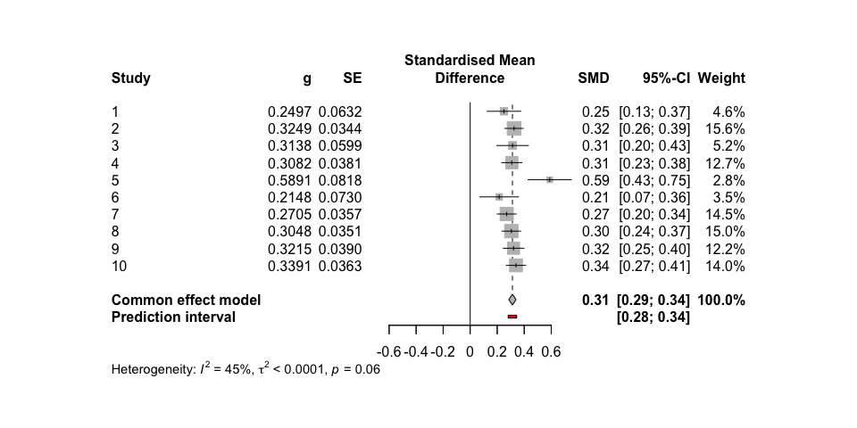
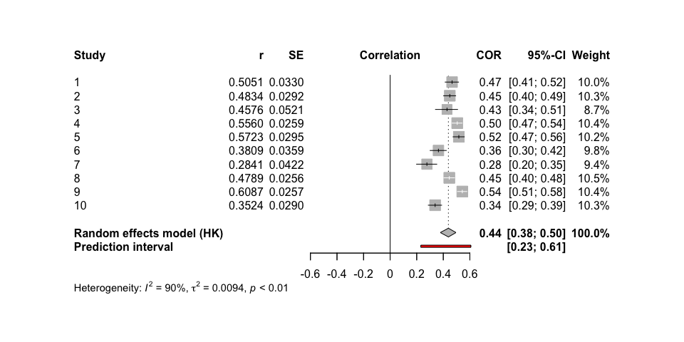
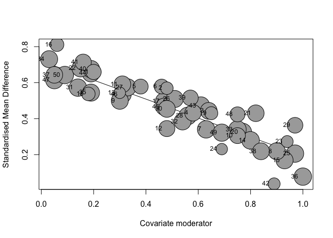

<!-- README.md is generated from README.Rmd. Please edit that file -->

# metafun

<!-- badges: start -->
<!-- badges: end -->

‘metafun’ offers valuable functions for teaching and understanding
statistical concepts related to meta-analyses using a simulation-based
approach. Please note that this package is currently under development,
and full functionality is not yet available.

## Installation

You can install the development version of metafun from
[GitHub](https://github.com/) with:

``` r
# install.packages("devtools")
devtools::install_github("simschaefer/metafun")
```

Load package in R:

``` r
require(metafun)
#> Loading required package: metafun
```

# Standardized Mean Differences

## Fixed Effect Model

### Simulate Data

Simulates data of multiple studies using predefined effect sizes and
between study heterogenity ($\tau$).

``` r
sim <- sim_meta(min_obs = 20,
         max_obs = 2000,
         n_studies = 1500,
         smd_true = 0.3,
         r_true = 0,
         random = FALSE,
         metaregression = FALSE)

head(sim)
#> # A tibble: 6 × 14
#>   study hedges_g        z        r   se_g   se_z    mean1 mean2   sd1   sd2
#>   <int>    <dbl>    <dbl>    <dbl>  <dbl>  <dbl>    <dbl> <dbl> <dbl> <dbl>
#> 1     1    0.255 -0.0167  -0.0167  0.0521 0.0368 -0.00626 0.251 0.979 1.04 
#> 2     2    0.435  0.00588  0.00588 0.0414 0.0290 -0.0462  0.382 1.00  0.967
#> 3     3    0.350 -0.0486  -0.0486  0.0423 0.0297 -0.0119  0.337 0.995 1.00 
#> 4     4    0.403 -0.0603  -0.0602  0.104  0.0735 -0.0313  0.382 1.04  1.00 
#> 5     5    0.302  0.0510   0.0510  0.0611 0.0431 -0.0144  0.289 1.04  0.965
#> 6     6    0.338 -0.00818 -0.00818 0.0328 0.0231 -0.0286  0.310 0.977 1.03 
#> # ℹ 4 more variables: n1 <int>, n2 <int>, n <int>, variance_g <dbl>
```

### Effect size and standard error

``` r
require(tidyverse)

ggplot(sim, aes(x = hedges_g, y = log(se_g), color = n1))+
  geom_point(alpha = 0.5)+
  theme_minimal()+
  labs(x = "Effect Size (ES)",
       y = "log(SE)")+
  scale_color_viridis_c()
```


### Run Meta-Analysis on simulated data

``` r
require(meta)

#select only studies 1-10 for better readability
sim <- sim %>% 
  filter(study <= 10)

meta_fixed <- metagen(TE = hedges_g,
                 seTE = se_g,
                 studlab = study,
                 data = sim,
                 sm = "SMD",
                 fixed = TRUE,
                 random = FALSE,
                 title = "Meta-Analysis Fixed effect")

summary(meta_fixed)
#> Review:     Meta-Analysis Fixed effect
#> 
#>       SMD           95%-CI %W(common)
#> 1  0.2551 [0.1529; 0.3572]        7.8
#> 2  0.4351 [0.3539; 0.5162]       12.3
#> 3  0.3497 [0.2669; 0.4325]       11.8
#> 4  0.4028 [0.1986; 0.6070]        1.9
#> 5  0.3016 [0.1818; 0.4215]        5.6
#> 6  0.3377 [0.2734; 0.4021]       19.6
#> 7  0.2818 [0.1962; 0.3673]       11.1
#> 8  0.1873 [0.0705; 0.3042]        5.9
#> 9  0.3159 [0.2054; 0.4264]        6.6
#> 10 0.2033 [0.1349; 0.2716]       17.4
#> 
#> Number of studies: k = 10
#> 
#>                        SMD           95%-CI     z  p-value
#> Common effect model 0.3040 [0.2756; 0.3325] 20.94 < 0.0001
#> 
#> Quantifying heterogeneity:
#>  tau^2 = 0.0040 [0.0007; 0.0179]; tau = 0.0631 [0.0262; 0.1337]
#>  I^2 = 66.0% [33.6%; 82.6%]; H = 1.72 [1.23; 2.40]
#> 
#> Test of heterogeneity:
#>      Q d.f. p-value
#>  26.50    9  0.0017
#> 
#> Details on meta-analytical method:
#> - Inverse variance method
#> - Restricted maximum-likelihood estimator for tau^2
#> - Q-Profile method for confidence interval of tau^2 and tau
```

### Forest plot

``` r
metafor::forest(meta_fixed,
             prediction = TRUE, 
             print.tau2 = TRUE,
             leftlabs = c("Study", "g", "SE"))
```



## Random-Effects model Standardized Mean Difference

### Simulate Data

``` r
sim <- sim_meta(min_obs = 200,
         max_obs = 2000,
         n_studies = 10,
         smd_true = 0.7,
         random = TRUE,
         random_effects = c('SMD'),
         tau = 0.05)

head(sim)
#> # A tibble: 6 × 14
#>   study hedges_g        z        r   se_g   se_z     mean1 mean2   sd1   sd2
#>   <int>    <dbl>    <dbl>    <dbl>  <dbl>  <dbl>     <dbl> <dbl> <dbl> <dbl>
#> 1     1    0.697 -0.00662 -0.00662 0.0601 0.0414  0.00824  0.693 1.00  0.962
#> 2     2    0.855 -0.00160 -0.00160 0.0360 0.0244 -0.0942   0.762 1.00  1.00 
#> 3     3    0.723 -0.00202 -0.00202 0.0456 0.0313  0.0228   0.741 0.975 1.01 
#> 4     4    0.637  0.0221   0.0221  0.0347 0.0240  0.000369 0.631 0.993 0.985
#> 5     5    0.634 -0.0298  -0.0298  0.0352 0.0243  0.0130   0.636 0.959 1.01 
#> 6     6    0.818 -0.00785 -0.00785 0.0496 0.0338 -0.119    0.686 0.999 0.971
#> # ℹ 4 more variables: n1 <int>, n2 <int>, n <int>, variance_g <dbl>
```

### Run Meta-Analysis on simulated data

``` r
require(meta)
require(metafor)

meta_random <- metagen(TE = hedges_g,
                 seTE = se_g,
                 studlab = study,
                 data = sim,
                 sm = "SMD",
                 fixed = FALSE,
                 random = TRUE,
                 method.tau = 'REML',
                 method.random.ci = "HK",
                 title = "Meta-Analysis Random Effects")

summary(meta_random)
#> Review:     Meta-Analysis Random Effects
#> 
#>       SMD           95%-CI %W(random)
#> 1  0.6969 [0.5791; 0.8147]        9.2
#> 2  0.8549 [0.7844; 0.9254]       10.6
#> 3  0.7234 [0.6340; 0.8129]       10.0
#> 4  0.6371 [0.5691; 0.7052]       10.6
#> 5  0.6345 [0.5655; 0.7034]       10.6
#> 6  0.8176 [0.7203; 0.9148]        9.8
#> 7  0.4837 [0.3741; 0.5934]        9.4
#> 8  0.7477 [0.6685; 0.8269]       10.3
#> 9  0.6893 [0.6085; 0.7701]       10.3
#> 10 0.9534 [0.8376; 1.0692]        9.2
#> 
#> Number of studies: k = 10
#> 
#>                              SMD           95%-CI     t  p-value
#> Random effects model (HK) 0.7231 [0.6312; 0.8150] 17.80 < 0.0001
#> 
#> Quantifying heterogeneity:
#>  tau^2 = 0.0138 [0.0054; 0.0543]; tau = 0.1175 [0.0735; 0.2331]
#>  I^2 = 86.0% [76.1%; 91.8%]; H = 2.67 [2.04; 3.49]
#> 
#> Test of heterogeneity:
#>      Q d.f.  p-value
#>  64.16    9 < 0.0001
#> 
#> Details on meta-analytical method:
#> - Inverse variance method
#> - Restricted maximum-likelihood estimator for tau^2
#> - Q-Profile method for confidence interval of tau^2 and tau
#> - Hartung-Knapp adjustment for random effects model (df = 9)


metafor::forest(meta_random,
             prediction = TRUE, 
             print.tau2 = TRUE,
             leftlabs = c("Study", "g", "SE"))
```


# Correlations

## Fixed Effect Model

### Simulate data

Simulates data of multiple studies using predefined effect sizes and
between study heterogenity ($\tau$).

``` r
sim <- sim_meta(min_obs = 200,
         max_obs = 2000,
         n_studies = 10,
         smd_true = 0,
         r_true = 0.5,
         random = FALSE)

head(sim)
#> # A tibble: 6 × 14
#>   study  hedges_g     z     r   se_g   se_z     mean1    mean2   sd1   sd2    n1
#>   <int>     <dbl> <dbl> <dbl>  <dbl>  <dbl>     <dbl>    <dbl> <dbl> <dbl> <int>
#> 1     1  0.0380   0.519 0.477 0.0650 0.0461 -0.0328    0.00394 0.928 1.00    474
#> 2     2 -0.0975   0.559 0.507 0.0469 0.0332  0.000426 -0.0967  0.983 1.01    911
#> 3     3 -0.0219   0.572 0.517 0.0342 0.0242  0.00804  -0.0139  1.01  0.996  1710
#> 4     4  0.0510   0.540 0.493 0.0517 0.0366 -0.0619   -0.0110  0.981 1.02    748
#> 5     5  0.0118   0.549 0.500 0.0384 0.0272 -0.00672   0.00511 0.993 1.01   1353
#> 6     6  0.000527 0.522 0.479 0.0333 0.0236 -0.0101   -0.00958 0.980 0.985  1803
#> # ℹ 3 more variables: n2 <int>, n <int>, variance_g <dbl>
```

### Run Meta-Analysis on simulated data

``` r
require(meta)

meta_fixed <- metagen(TE = z,
                 seTE = se_z,
                 studlab = study,
                 data = sim,
                 sm = "ZCOR",
                 fixed = TRUE,
                 random = FALSE,
                 title = "Meta-Analysis Fixed effect")

summary(meta_fixed)
#> Review:     Meta-Analysis Fixed effect
#> 
#>       COR           95%-CI %W(common)
#> 1  0.4767 [0.4039; 0.5434]        4.2
#> 2  0.5070 [0.4571; 0.5537]        8.1
#> 3  0.5170 [0.4814; 0.5509]       15.2
#> 4  0.4926 [0.4364; 0.5451]        6.6
#> 5  0.4999 [0.4588; 0.5388]       12.0
#> 6  0.4792 [0.4428; 0.5140]       16.0
#> 7  0.4966 [0.4596; 0.5319]       14.8
#> 8  0.4876 [0.4243; 0.5461]        5.4
#> 9  0.5028 [0.4576; 0.5454]        9.9
#> 10 0.5267 [0.4770; 0.5731]        7.7
#> 
#> Number of studies: k = 10
#> 
#>                        COR           95%-CI     z p-value
#> Common effect model 0.4997 [0.4856; 0.5134] 58.16       0
#> 
#> Quantifying heterogeneity:
#>  tau^2 = 0 [0.0000; 0.0005]; tau = 0 [0.0000; 0.0215]
#>  I^2 = 0.0% [0.0%; 62.4%]; H = 1.00 [1.00; 1.63]
#> 
#> Test of heterogeneity:
#>     Q d.f. p-value
#>  4.20    9  0.8977
#> 
#> Details on meta-analytical method:
#> - Inverse variance method
#> - Restricted maximum-likelihood estimator for tau^2
#> - Q-Profile method for confidence interval of tau^2 and tau
#> - Fisher's z transformation of correlations
```

### Forest plot

``` r
metafor::forest(meta_fixed,
             prediction = TRUE, 
             print.tau2 = TRUE,
             leftlabs = c("Study", "r", "SE"))
```


## Random Effects Model

### Simulate data

``` r
sim <- sim_meta(min_obs = 200,
         max_obs = 2000,
         n_studies = 10,
         smd_true = 0,
         r_true = 0.5,
         random = TRUE,
         random_effects = c('ZCOR'),
         tau = 0.1)

head(sim)
#> # A tibble: 6 × 14
#>   study hedges_g     z     r   se_g   se_z     mean1    mean2   sd1   sd2    n1
#>   <int>    <dbl> <dbl> <dbl>  <dbl>  <dbl>     <dbl>    <dbl> <dbl> <dbl> <int>
#> 1     1 -0.00565 0.541 0.494 0.0923 0.0657 -0.0975   -0.103   0.937 0.988   235
#> 2     2 -0.0212  0.556 0.505 0.0389 0.0276 -0.00869  -0.0296  0.991 0.980  1320
#> 3     3  0.0143  0.584 0.526 0.0356 0.0252 -0.0159   -0.00137 1.02  1.01   1580
#> 4     4 -0.00634 0.675 0.588 0.0345 0.0244 -0.000234 -0.00632 0.953 0.967  1677
#> 5     5 -0.0195  0.434 0.409 0.0320 0.0226 -0.00888  -0.0285  1.00  1.00   1953
#> 6     6  0.00634 0.638 0.564 0.0370 0.0262 -0.0129   -0.00656 0.990 1.01   1459
#> # ℹ 3 more variables: n2 <int>, n <int>, variance_g <dbl>
```

### Run Meta-Analysis on simulated data

``` r

meta_random <- metagen(TE = z,
                 seTE = se_z,
                 studlab = study,
                 data = sim,
                 sm = "ZCOR",
                 fixed = FALSE,
                 random = TRUE,
                 method.tau = 'REML',
                 method.random.ci = "HK",
                 title = "Meta-Analysis Random Effects")

summary(meta_random)
#> Review:     Meta-Analysis Random Effects
#> 
#>       COR           95%-CI %W(random)
#> 1  0.4941 [0.3908; 0.5850]        8.6
#> 2  0.5048 [0.4635; 0.5440]       10.1
#> 3  0.5258 [0.4892; 0.5606]       10.2
#> 4  0.5881 [0.5559; 0.6186]       10.2
#> 5  0.4087 [0.3710; 0.4450]       10.3
#> 6  0.5638 [0.5277; 0.5978]       10.2
#> 7  0.6422 [0.6124; 0.6702]       10.2
#> 8  0.4406 [0.3903; 0.4884]       10.0
#> 9  0.4740 [0.4333; 0.5128]       10.2
#> 10 0.2544 [0.1973; 0.3097]       10.0
#> 
#> Number of studies: k = 10
#> 
#>                              COR           95%-CI     t  p-value
#> Random effects model (HK) 0.4963 [0.4173; 0.5679] 12.31 < 0.0001
#> 
#> Quantifying heterogeneity:
#>  tau^2 = 0.0188 [0.0084; 0.0636]; tau = 0.1371 [0.0915; 0.2522]
#>  I^2 = 96.2% [94.5%; 97.3%]; H = 5.10 [4.25; 6.12]
#> 
#> Test of heterogeneity:
#>       Q d.f.  p-value
#>  233.90    9 < 0.0001
#> 
#> Details on meta-analytical method:
#> - Inverse variance method
#> - Restricted maximum-likelihood estimator for tau^2
#> - Q-Profile method for confidence interval of tau^2 and tau
#> - Hartung-Knapp adjustment for random effects model (df = 9)
#> - Fisher's z transformation of correlations


metafor::forest(meta_random,
             prediction = TRUE, 
             print.tau2 = TRUE,
             leftlabs = c("Study", "r", "SE"))
```



# Subgroup-Analysis Standardized Mean Difference

### Simulate Data

``` r
sim <- sim_meta(min_obs = 200,
         max_obs = 2000,
         n_studies = 30,
         smd_true = 0.2,
         r_true = 0,
         random = TRUE,
         tau = 0.1,
         random_effects = c('SMD'),
         metaregression = TRUE,
         smd_mod_effects = c(0.1,0.2,0.3),
         r_mod_effects = c(0,0,0),
         mod_labels = c('group1', 'group2', 'group3'))

head(sim %>% 
       select(study, hedges_g, subgroups, everything()))
#> # A tibble: 6 × 19
#>   study hedges_g subgroups         z        r   se_g   se_z    mean1 mean2   sd1
#>   <int>    <dbl> <chr>         <dbl>    <dbl>  <dbl>  <dbl>    <dbl> <dbl> <dbl>
#> 1     1    0.458 group3     0.0197    1.97e-2 0.0413 0.0289  0.0899  0.545  1.02
#> 2     2    0.237 group2    -0.0135   -1.35e-2 0.0500 0.0353  0.0700  0.308  1.01
#> 3     3    0.168 group2     0.000616  6.16e-4 0.0641 0.0454  0.103   0.267  1.00
#> 4     4    0.504 group3     0.0297    2.97e-2 0.0658 0.0459  0.117   0.619  1.02
#> 5     5    0.537 group1    -0.0307   -3.07e-2 0.0350 0.0243 -0.151   0.385  1.01
#> 6     6    0.339 group1    -0.0412   -4.12e-2 0.0447 0.0314  0.00187 0.335  1.00
#> # ℹ 9 more variables: sd2 <dbl>, n1 <int>, n2 <int>, n <int>,
#> #   smd_mod_effects <dbl>, r_mod_effects <dbl>, r_true <dbl>, smd_true <dbl>,
#> #   variance_g <dbl>
```

### Run Meta-Analysis on simulated data

``` r
meta_random <- metagen(TE = hedges_g,
                 seTE = se_g,
                 studlab = study,
                 data = sim,
                 sm = "SMD",
                 fixed = FALSE,
                 random = TRUE,
                 method.tau = 'REML',
                 method.random.ci = "HK",
                 subgroup = subgroups,
                 title = "Meta-Analysis Random Effects")

summary(meta_random)
#> Review:     Meta-Analysis Random Effects
#> 
#>       SMD           95%-CI %W(random) subgroups
#> 1  0.4580 [0.3771; 0.5390]        3.4    group3
#> 2  0.2372 [0.1392; 0.3353]        3.3    group2
#> 3  0.1680 [0.0425; 0.2936]        3.2    group2
#> 4  0.5043 [0.3753; 0.6332]        3.2    group3
#> 5  0.5368 [0.4683; 0.6053]        3.5    group1
#> 6  0.3390 [0.2515; 0.4266]        3.4    group1
#> 7  0.3351 [0.2446; 0.4256]        3.4    group2
#> 8  0.3287 [0.1995; 0.4580]        3.1    group2
#> 9  0.3551 [0.2467; 0.4635]        3.3    group2
#> 10 0.2538 [0.1881; 0.3194]        3.5    group2
#> 11 0.4166 [0.2548; 0.5784]        2.9    group1
#> 12 0.0999 [0.0326; 0.1671]        3.5    group2
#> 13 0.2722 [0.2010; 0.3435]        3.5    group1
#> 14 0.2838 [0.1789; 0.3888]        3.3    group2
#> 15 0.3640 [0.2444; 0.4836]        3.2    group1
#> 16 0.5156 [0.4350; 0.5961]        3.4    group1
#> 17 0.7135 [0.6157; 0.8112]        3.4    group3
#> 18 0.3510 [0.2825; 0.4194]        3.5    group1
#> 19 0.6357 [0.5140; 0.7574]        3.2    group3
#> 20 0.4641 [0.3808; 0.5474]        3.4    group1
#> 21 0.5419 [0.4124; 0.6714]        3.1    group2
#> 22 0.6122 [0.5414; 0.6831]        3.5    group2
#> 23 0.2686 [0.1747; 0.3625]        3.4    group1
#> 24 0.3363 [0.2652; 0.4075]        3.5    group1
#> 25 0.6770 [0.6122; 0.7418]        3.5    group3
#> 26 0.8619 [0.7369; 0.9868]        3.2    group3
#> 27 0.3686 [0.2016; 0.5357]        2.9    group1
#> 28 0.3100 [0.2366; 0.3835]        3.5    group1
#> 29 0.4494 [0.3253; 0.5734]        3.2    group2
#> 30 0.2912 [0.2283; 0.3541]        3.5    group1
#> 
#> Number of studies: k = 30
#> 
#>                              SMD           95%-CI     t  p-value
#> Random effects model (HK) 0.4105 [0.3469; 0.4741] 13.20 < 0.0001
#> 
#> Quantifying heterogeneity:
#>  tau^2 = 0.0265 [0.0158; 0.0497]; tau = 0.1626 [0.1258; 0.2230]
#>  I^2 = 93.1% [91.2%; 94.6%]; H = 3.80 [3.36; 4.29]
#> 
#> Test of heterogeneity:
#>       Q d.f.  p-value
#>  418.61   29 < 0.0001
#> 
#> Results for subgroups (random effects model (HK)):
#>                      k    SMD           95%-CI  tau^2    tau      Q   I^2
#> subgroups = group3   6 0.6402 [0.4876; 0.7929] 0.0180 0.1343  39.04 87.2%
#> subgroups = group2  11 0.3318 [0.2279; 0.4358] 0.0217 0.1474 135.18 92.6%
#> subgroups = group1  13 0.3707 [0.3158; 0.4256] 0.0067 0.0820  62.43 80.8%
#> 
#> Test for subgroup differences (random effects model (HK)):
#>                    Q d.f.  p-value
#> Between groups 19.82    2 < 0.0001
#> 
#> Details on meta-analytical method:
#> - Inverse variance method
#> - Restricted maximum-likelihood estimator for tau^2
#> - Q-Profile method for confidence interval of tau^2 and tau
#> - Hartung-Knapp adjustment for random effects model (df = 29)


metafor::forest(meta_random,
             prediction = TRUE, 
             print.tau2 = TRUE,
             leftlabs = c("Study", "g", "SE"))
```


# Metaregression

## Simulate Data

``` r

# define values of moderator variable:
x <- 1:100/100

# define slope:
b <- -0.5

df <- sim_meta(min_obs = 100,
               max_obs = 1000,
               n_studies = 50,
               smd_true = 0,
               r_true = 0,
               random = FALSE,
               metaregression = TRUE,
               mod_name = 'moderator',
               smd_mod_effects = b*x,
               r_mod_effects = rep(0,100),
               mod_labels = x)

# show correlation between moderator and effect size
df %>% 
  mutate(g_upper = hedges_g + 1.96*se_g,
         g_lower = hedges_g - 1.96*se_g) %>% 
ggplot(aes(moderator,hedges_g))+
  geom_point()+
  geom_errorbar(aes(ymin = g_lower, ymax = g_upper))+
  geom_smooth(method = 'lm', se = FALSE, color = 'steelblue')
#> `geom_smooth()` using formula = 'y ~ x'
```


``` r

mg <- metagen(TE = hedges_g,
              seTE = se_g,
              studlab = study,
              data = df,
              sm = "SMD",
              fixed = TRUE,
              random = FALSE,
              method.tau = 'REML',
              title = "Meta-Analysis fixed-effect",
              tau.common = FALSE)

m.gen.reg <- metareg(mg, ~moderator)

summary(m.gen.reg)
#> 
#> Mixed-Effects Model (k = 50; tau^2 estimator: REML)
#> 
#>    logLik   deviance        AIC        BIC       AICc   
#>   68.1135  -136.2270  -130.2270  -124.6134  -129.6815   
#> 
#> tau^2 (estimated amount of residual heterogeneity):     0 (SE = 0.0007)
#> tau (square root of estimated tau^2 value):             0
#> I^2 (residual heterogeneity / unaccounted variability): 0.00%
#> H^2 (unaccounted variability / sampling variability):   1.00
#> R^2 (amount of heterogeneity accounted for):            100.00%
#> 
#> Test for Residual Heterogeneity:
#> QE(df = 48) = 36.2871, p-val = 0.8925
#> 
#> Test of Moderators (coefficient 2):
#> QM(df = 1) = 252.6454, p-val < .0001
#> 
#> Model Results:
#> 
#>            estimate      se      zval    pval    ci.lb    ci.ub      
#> intrcpt      0.0085  0.0169    0.5068  0.6123  -0.0245   0.0416      
#> moderator   -0.4808  0.0303  -15.8948  <.0001  -0.5401  -0.4216  *** 
#> 
#> ---
#> Signif. codes:  0 '***' 0.001 '**' 0.01 '*' 0.05 '.' 0.1 ' ' 1

bubble(m.gen.reg, studlab = TRUE)
```


